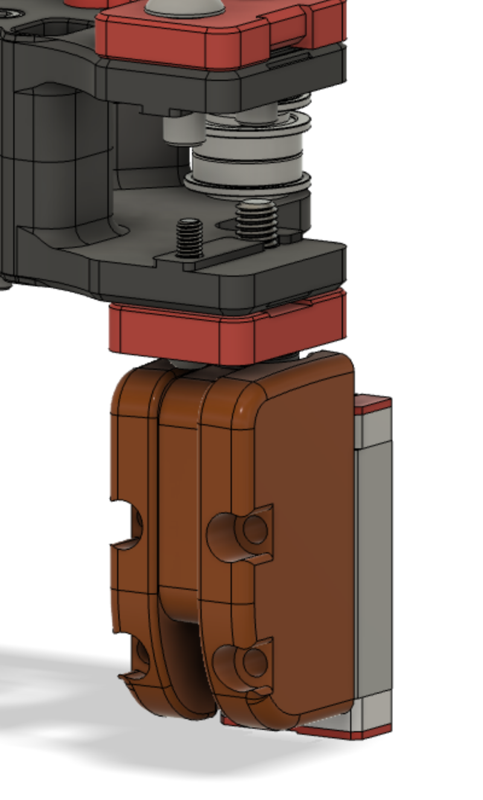
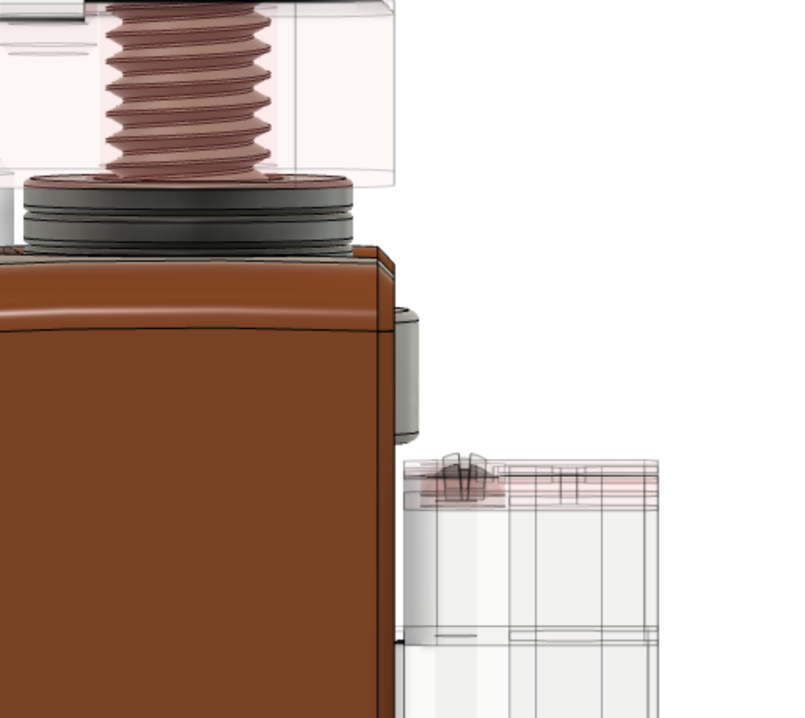
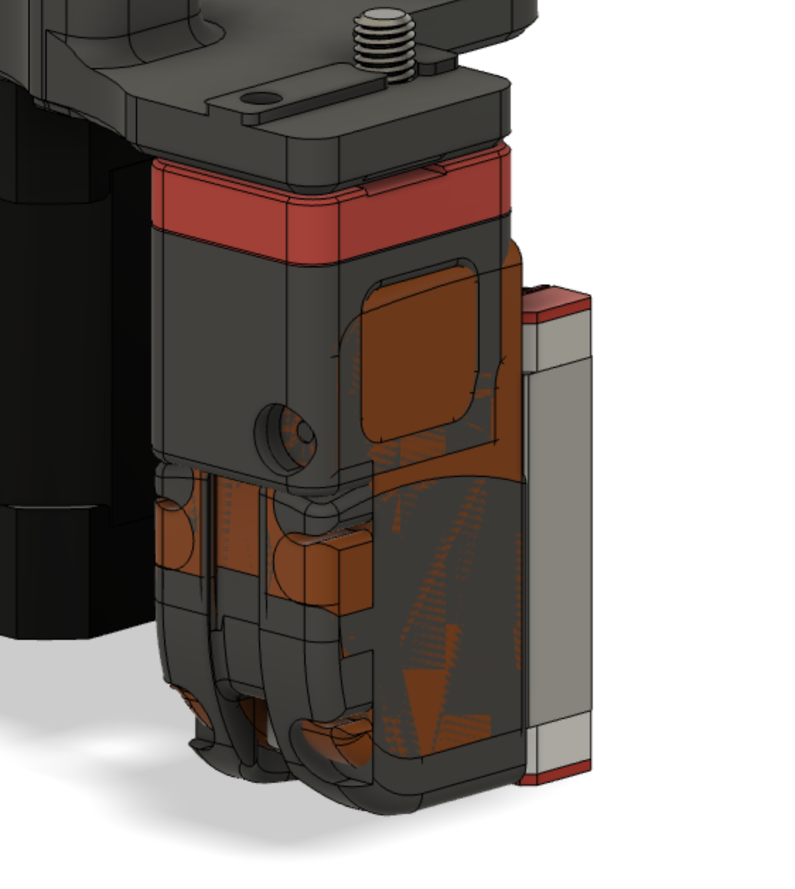
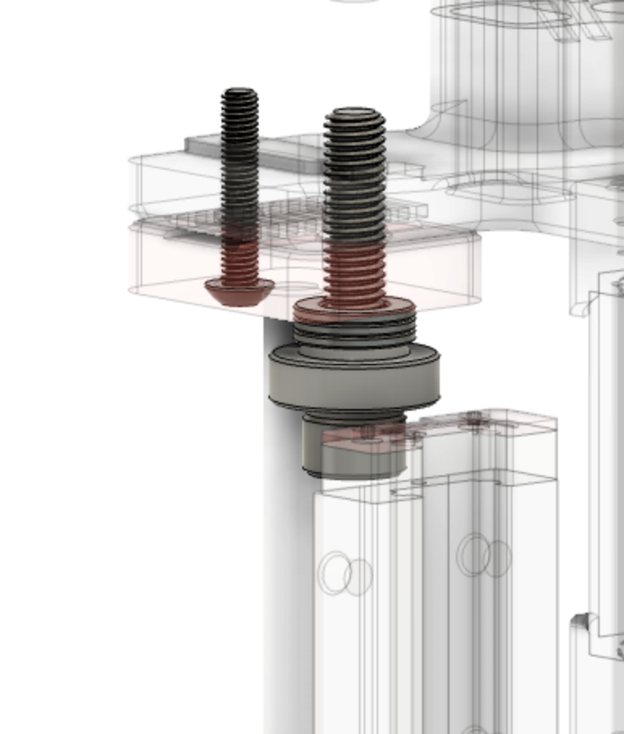

# Fivehead GE5C bearing mod

	
This is a just a little mod to quickly and easily swap out the stock Z bearing blocks for GE5C-style spherical bearings. 

It is based (obviously) on Hartk's awesome [GE5C mod](https://github.com/VoronDesign/VoronUsers/tree/master/printer_mods/hartk1213/Voron2.4_GE5C), but with a small change: it positions the bearings above the carriage block, allowing the M5 SHCS to be positioned precisely below the stock M5 screw location. Otherwise, the GE5C bearings stick out *just a bit* and interfere with the carriage.

This probably doesn't matter at all; plenty of people have installed the original mod with great success. But in case it bothers you, just a little bit, here's another option for ya.

I've also added a small threaded hole in the center of the Hall Effect version, allowing you to attach a ~6mm countersunk magnet with a screw.

That's it! That's all it is.

## Stuff you need

- 4x GE5C bearings
- 4x M3x16 BHCS (to replace the M3x30 in the stock assembly)
- 4x M3x25 SHCS (to attach the GE5C bearing)
- 12x 1mm M5 shim washers (to space the GE5C away from the belt clamps

I was able to install these pretty quickly by:

1. blocking the gantry up
2. removing one Z idler completely, releasing all tension on the belt
3. removing the Z bearing assembly for that corner
4. unscrewing M3 and M5 BHCS from the clamp
5. quickly installing the new M3x16 BHCS to re-clamp the belt
6. installing the rest of the stuff

