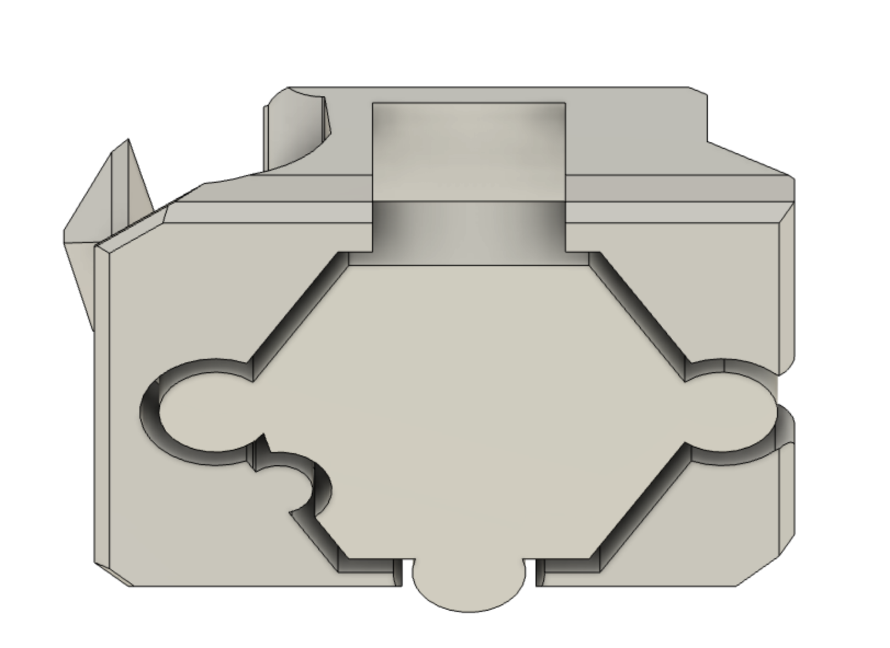
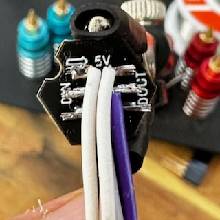
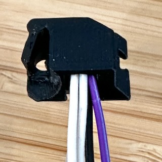

# Rainbow Barf Logo LED for StealthBurner

### *a [vinnycordeiro](https://github.com/VinnyCordeiro/) and whoppingpochard jam*

-----------

Ok, sure, it's pretty cool to have the Voron logo on the StealthBurner light up. And, yeah, it's even cooler to have it change colors. But wouldn't it be *even cooler still* to have it do *this*?

The Rainbow Barf Logo LED is a small PCB, approximately the size of a typical single 5050 WS2812 "Neopixel" PCB, but holding *eight* miniature protocol-compatible LEDs positioned to match the logo cutout on the StealthBurner.

This gives you the possibility to programmatically address each part of the logo lighting independently! Imagine the possibilities!

## Where can I get one?

This project is a collaboration between myself and [vinnycordeiro](https://github.com/VinnyCordeiro/) on the Doomcube Discord server. We have gotten some panels of these PCBs made for Voron retailers, including DFH, West3D, Fabreeko, and PrintyPlease. If you'd like, you can pick one up at their stores for a reasonable price.

Alternatively, you can have your own made from JLCPCB or another PCB prototyping service. The Gerber files, as well as BOM and placement files (in JLCPCB format) can be found in the [Production_Files]('./Production_Files') folder.

## What are the downsides?

None! You can now combine RGB and RGBW LEDs in the same string in Klipper! See [this pull request](https://github.com/Klipper3d/klipper/pull/5409). 

## Printed parts and assembly

You'll need to print two parts: a special carrier, and a special diffuser. 

The diffuser differs from the stock diffuser in having eight open channels to bring each LED's light up to the surface of the diffuser before mixing. As such, diffusion only happens in the last few layers. Thus, I think the effect looks best using a translucent rather than transparent filament. 

The carrier STL has built-in supports:

And the bottom has cutouts that 1) index with the notch in the RBB PCB to ensure correct orientation, and 2) to allow some ragged edges from the mousebites in panel-fabricated PCBs.

When soldering up the PCB, use the thinnest wires you can muster, and solder them in a 'pine tree' arrangement, starting with the bottom pads and moving up:

When soldered, PCB and wires can be tucked neatly into the carrier and inserted into the toolhead.

## How do I make the shiny?

I will update this section with example code ~~soon~~ someday!