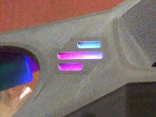

# Rainbow Barf Logo LED for StealthBurner

### *a [vinnycordeiro](https://github.com/VinnyCordeiro/) and whoppingpochard jam*

-----------

Ok, sure, it's pretty cool to have the Voron logo on the StealthBurner light up. And, yeah, it's even cooler to have it change colors. But wouldn't it be *even cooler still* to have it do *this*?

The Rainbow Barf Logo LED is a small PCB, approximately the size of a typical single 5050 WS2812 "Neopixel" PCB, but holding *eight* miniature protocol-compatible LEDs positioned to match the logo cutout on the StealthBurner.

This gives you the possibility to programmatically address each part of the logo lighting independently! Imagine the possibilities!

Once SB is out of beta testing, this repository will be updated with CAD and STLs for printing out the slightly different PCB carrier and diffuser you'll need to make it work with a StealthBurner toolhead -- and perhaps some others as well!

## Where can I get one?

This project is a collaboration between myself and [vinnycordeiro](https://github.com/VinnyCordeiro/) on the Doomcube Discord server. We have gotten some panels of these PCBs made for Voron retailers, including DFH, West3D, Fabreeko, and PrintyPlease. If you'd like, you can pick one up at their stores for a reasonable price.

Alternatively, you can have your own made from JLCPCB or another PCB prototyping service. The Gerber files, as well as BOM and placement files (in JLCPCB format) can be found in the [Production_Files]('./Production_Files') folder.

## What are the downsides?

The primary downside is that the tiny addressable RGB LEDs needed for this PCB are only available in RGB, and not RGBW, format. It is difficult (though [not impossible](https://github.com/sonyhome/FAB_LED/issues/13)) to combine these in the same strip. That means, to run the RBLL4SB, you'll need to do one of three things:

- use RGB (not RGBW) chips for the SB nozzle LEDs
- control the nozzle LEDs and RBLL4SB using separate data pins
- use a custom communication protocol that can hack the bitstream correctly

I believe the latter solution is in-process at the [Klipper-led_effect](https://github.com/julianschill/klipper-led_effect) repository, which is what I recommend for controlling the RBLL4SB anyway! Woohoo!!

## How do I make the shiny?

I will update this section with example code soon!