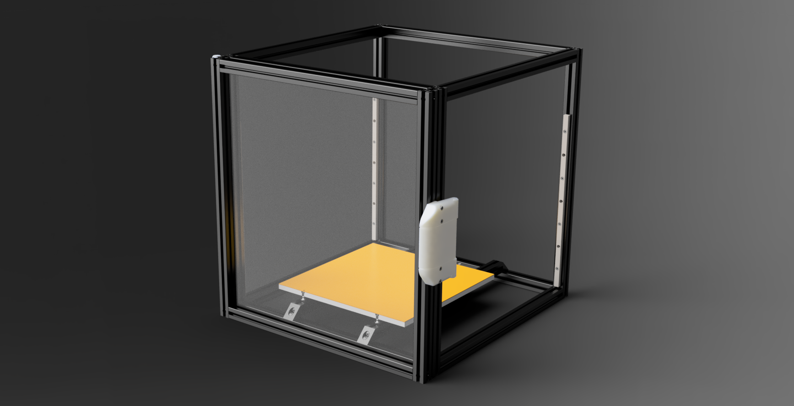
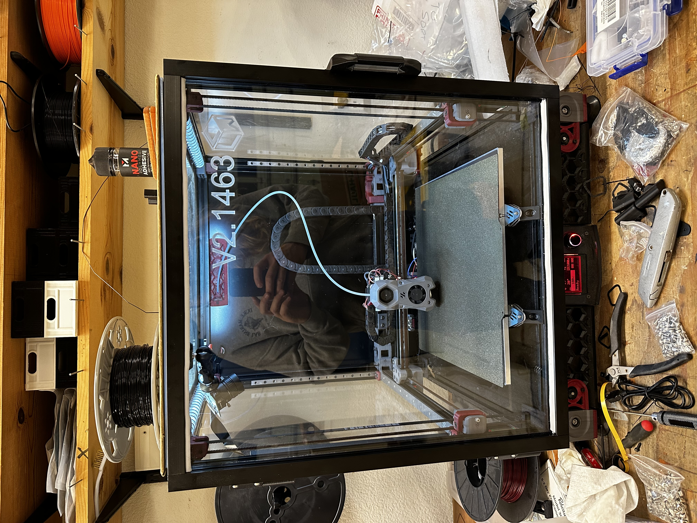
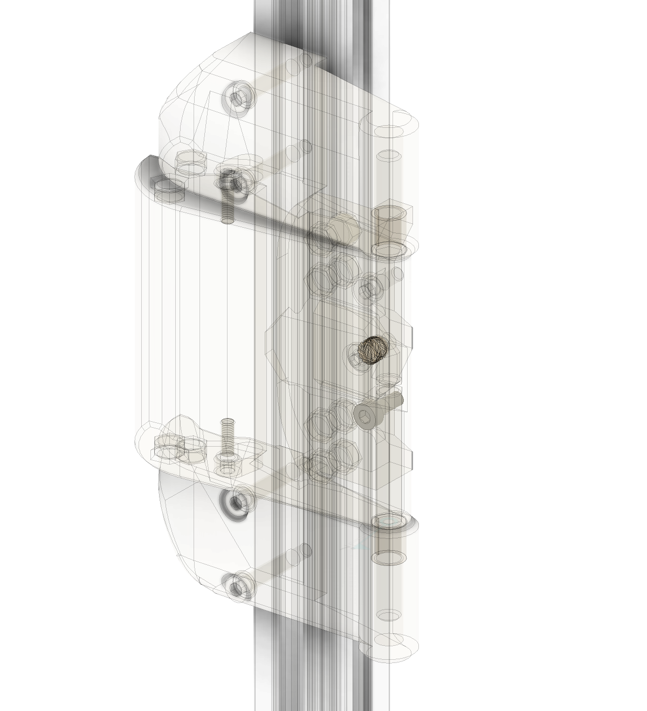
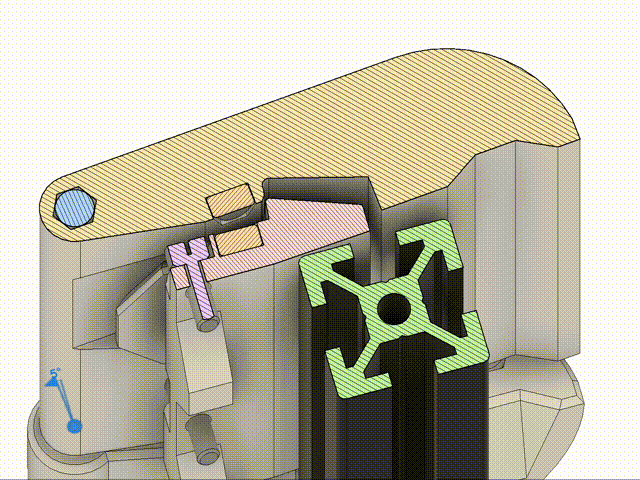
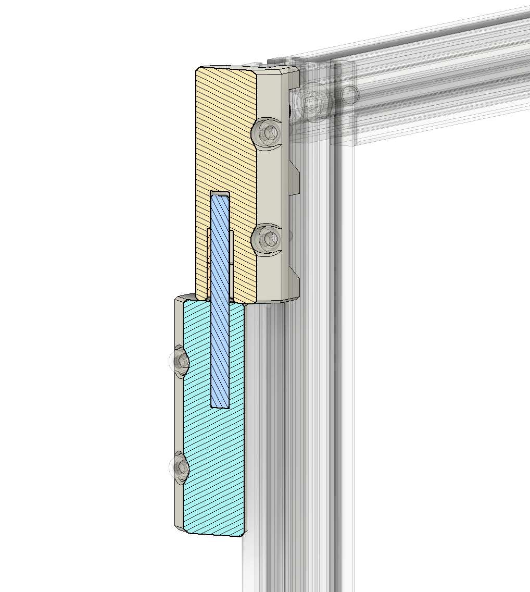

# Clicky-Clack Fridge Dooor

## Motivation

The stock Voron 2-panel doors don't seal very well, and I never really enjoyed using them. 

Inspired by Doc's fridge door mod and the [EZBake Trident Doom](https://github.com/FrankenVoron/Trident-EZBake) conversion, I set out to design a hinge and latch system that could securely close an extrusion-framed door against 3mm foam tape, while also yielding some satisfying sounds.

This solution is what fit the bill for me. The door opens smoothly, and can be easily removed from the hinges simply by lifting up. The latch mechanism actually draws the door closed against the sealing foam when closed, and clicks shut with the help of some magnets. It makes nice sounds.

https://github.com/tanaes/whopping_Voron_mods/assets/8292608/8dcf28dc-69ba-4f01-a6c4-658524717b99

I've found that this seals the chamber much more effectively than the stock doors, and have been running a prototype of this design on my 350-spec V2 for the past six months. 

## Bill Of Materials

**Notes:**

 - Voron 2.4 and Voron Trident share X frame dimensions but have different Y dimensions. 
 - Flat-front extrusions are specified (as pictured above), but standard extrusions are less expensive
 - The panel retention strip specified is black. A [more inexpensive option](https://us.misumi-ec.com/vona2/detail/110303061830/?HissuCode=NSCP3H-S-6) is light grey in color, but comes in a minimum of 6 meter lengths and only saves a few bucks over 2 meters of the nicer black stuff.
 - I have also just tried this even more [inexpensive alternative from AliExpress (affiliate link)](https://s.click.aliexpress.com/e/_DktkurN), in the "10x6 for 2-3mm board" flavor. It seems to fit the 3mm acrylic and seat snugly into Misumi extrusions. If you go this route, you *may* want to trim the panel another mm short for good measure, as this adds a mm of rubber between the panel edge and the extrusion. 
 - M5 dowel pins between 40mm and 50mm should work. The rounded-end pins make installing the door just a bit easier.
 - The sleeve bearings are the same size as used in the sexbolt endstop mod. You might have some on hand already!
 - 1/8" acrylic *sorta* works, but the extra 0.175mm makes the mounting strip *really* tight. I strongly recommend using actual 3mm thick stuff!  

|                           | **V2.4** | **VT** | **Qty** | **250**                 | **300**                 | **350**                 | **Link**                                                                                                                                                     |
| ------------------------- | -------- | ------ | ------- | ----------------------- | ----------------------- | ----------------------- | ------------------------------------------------------------------------------------------------------------------------------------------------------------ |
| **Door Frame X**          | **X**    | **X**  | 2       | HFSFB5-2020-370-TPW     | HFSFB5-2020-420-TPW     | HFSFB5-2020-470-TPW     |    [Misumi](https://us.misumi-ec.com/vona2/detail/110302683920/?HissuCode=HFSFB5-2020)                                                                                                                                                          |
| **Door Frame Z**          | **X**    |        | 2       | HFSFB5-2020-430-LCH-RCH | HFSFB5-2020-480-LCH-RCH | HFSFB5-2020-530-LCH-RCH |  [Misumi](https://us.misumi-ec.com/vona2/detail/110302683920/?HissuCode=HFSFB5-2020)                                                                                                                                                            |
| **Door Frame Z**          |          | **X**  | 2       | HFSFB5-2020-500-LCH-RCH | HFSFB5-2020-500-LCH-RCH | HFSFB5-2020-500-LCH-RCH |  [Misumi](https://us.misumi-ec.com/vona2/detail/110302683920/?HissuCode=HFSFB5-2020)                                                                                                                                                            |
| **Panel Retainer**        | **X**    | **X**  | 1       | HSCPF3H-B-2000          | HSCPF3H-B-2000          | HSCPF3H-B-2000          | [Misumi](https://us.misumi-ec.com/vona2/detail/110302263040/?HissuCode=HSCPF3H-B-2000) |
| **Door Panel**            | **X**    |        | 1       | 380mm x 400mm           | 430mm x 450mm           | 480mm x 500mm           | [US Plastic](https://www.usplastic.com/catalog/item.aspx?itemid=35665&catid=442)                                                                                           |
| **Door Panel**            |          | **X**  |         | 380mm x 470mm           | 430mm x 470mm           | 480mm x 470mm           | [US Plastic](https://www.usplastic.com/catalog/item.aspx?itemid=35665&catid=442)                                                                                                                                                              |
|                           |          |        |         |                         |                         |                         |                                                                                                                                                              |
| **M5x7x8 split_bushing**  | **X**    | **X**  | 6       |                         |                         |                         | [AliExpress (Affiliate)](https://s.click.aliexpress.com/e/_Dk0MBRd)                                                                       |
| **M5x45 Dowel Pin**       | **X**    | **X**  | 4       |                         |                         |                         | [AliExpress (Affiliate)](https://s.click.aliexpress.com/e/_DkDzN4B)                                                                       |
| **M3x20 SHCS**            | **X**    | **X**  | 4       |                         |                         |                         |                                                                                                                                                              |
| **M3x8 SHCS**             | **X**    | **X**  | 12      |                         |                         |                         |                                                                                                                                                              |
| **6x3mm magnet**          | **X**    | **X**  | 12      |                         |                         |                         |                                                                                                                                                              |
| **M3x8 BHCS**             | **X**    | **X**  | 1       |                         |                         |                         |                                                                                                                                                              |
| **M3x5x4 Heatset Insert** | **X**    | **X**  | 1       |                         |                         |                         |                                                                                                                                                              |
| **M5x16 BHCS**             | **X**    | **X**  | 4       |                         |                         |                         |                                                                                                                                                              |

## Printing

Parts should be oriented correctly in the STLs.

If you want to have the door open the other way (i.e. handle on left, hinge on right), just mirror the hinge pieces (Hinge-L-xxx). The handle and latch should be fine as-is. 

## Assembly

Hopefully this is pretty straightforward, but:

- Assemble three sides of the frame using M5x16 BHCS in blind joints. Insert the acrylic into the slot. Add the final side of the frame.
- Cut rubber panel mounting strip to length. Do 45° miters in the corners to be neat! Press rubber strips in to fix the acrylic in place.
- Assemble hinges
  - Tap M5x45mm pin in place in the 'solid' part with a hammer. It should be a very tight fit! Make sure not to overdo it -- you should have around 20mm sticking out the top when fully seated.
  - Install sleeve bearings in 'sleeve' part. The easiest way I've found to do this is to just slide 2 bearings over one of the pins you just installed, insert into the empty 'sleeve' part, and tap them into place with the hammer
- Install magnets
  - Press the 6x3mm magnets into the hexagon holes. You might want to add a dab of superglue into the bottom of each hole for long-term retention.
  - I like to put a magnet on the end of a steel tool (like a hammer or something) and use that to press into place
  - Pay attention to polarity! you want to make sure the magnets in the latch and handle attract each other, as well as in the handle and handle hinge.
- Assemble latch and handle
  - Add M3x8mm locating screws in handle. These prevent overtravel.
  - Add heatset insert into latch, and then screw in panel retention clip with M3x8mm BHCS.
  - Insert M5x45mm pins into handle. These should be a somewhat looser fit than the hinges pieces from earlier.
  - Install sleeve bearings into handle hinges. Only one bearing per hinge -- they should tap in nicely with a hammer.
  - You should now be able to slide the handle hinges onto the handle pins, and have the magnets keep them together. Nice!
- Install door
  - Fix door to printer frame temporarily. Blue tape works great.
  - Install door hinges. Pins should point up!
  - Install latch on opposite side. You'll likely need to remove the middle panel clip to do so.
  - Now, install handle over the latch. You might want to add a small shim (like a few pieces of paper) between the handle/handle hinge magnets during installation, to ensure it has some clearance to operate and doesn't bind up due to friction between the printed pieces.

## Images

