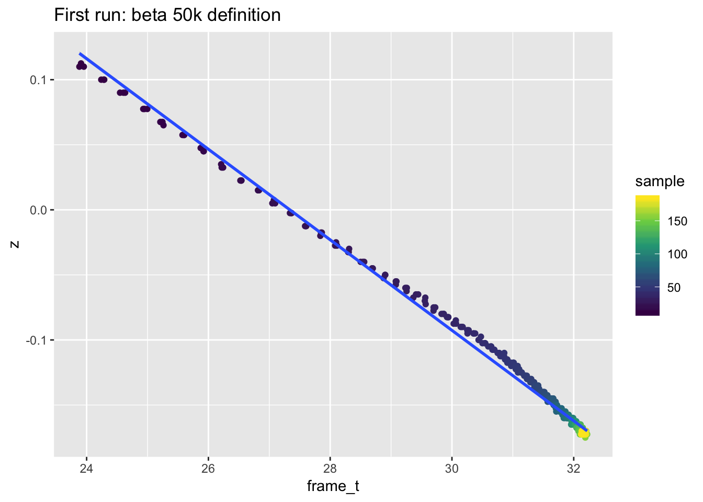
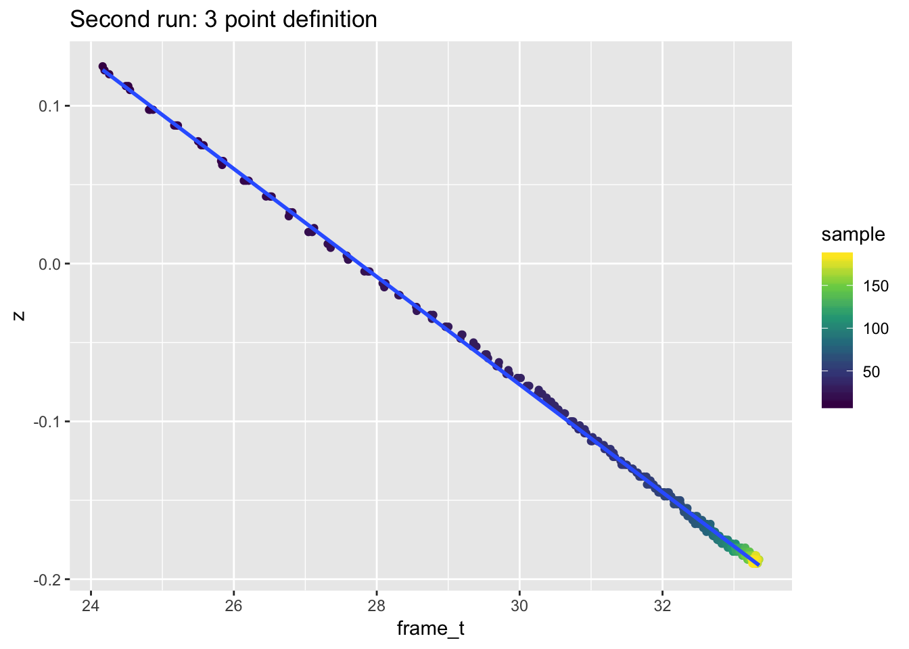
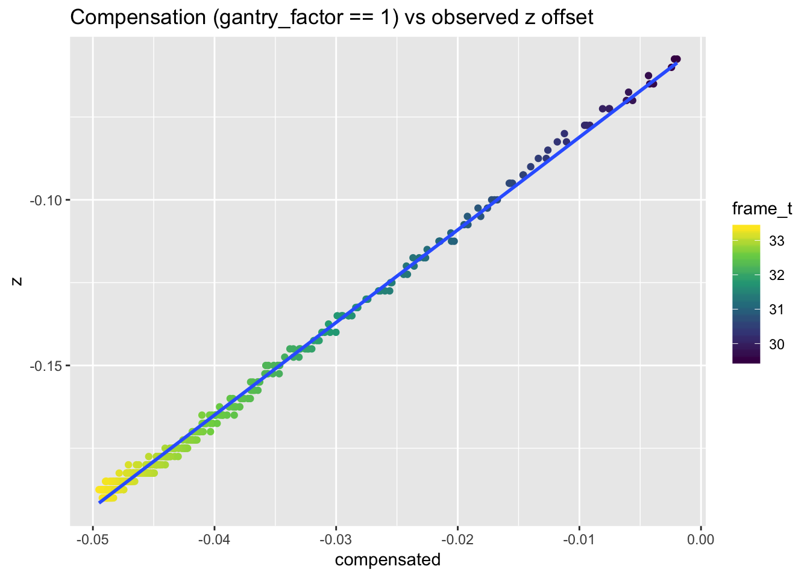
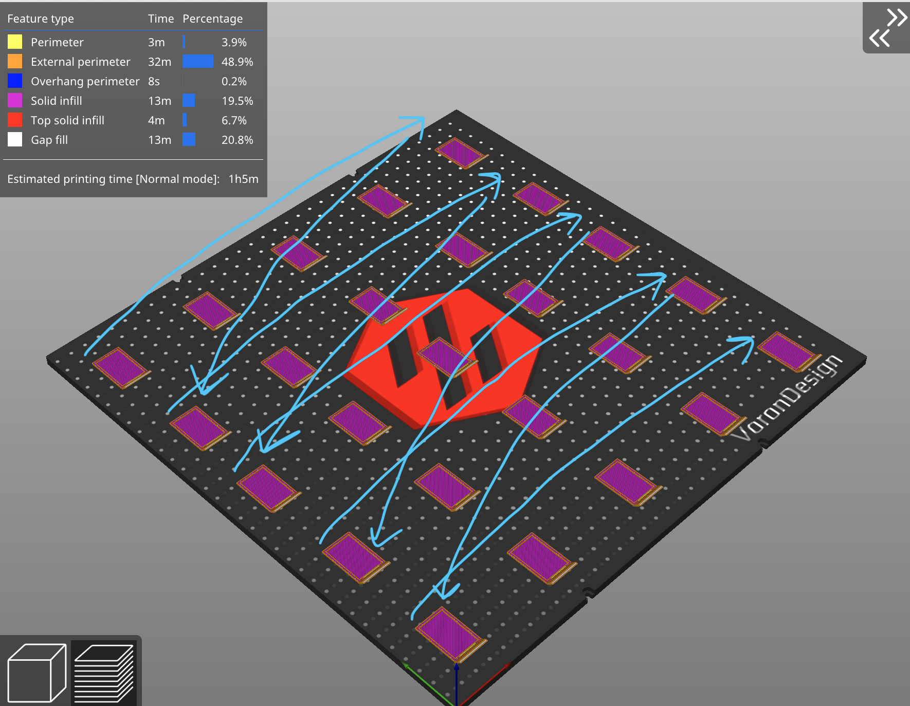
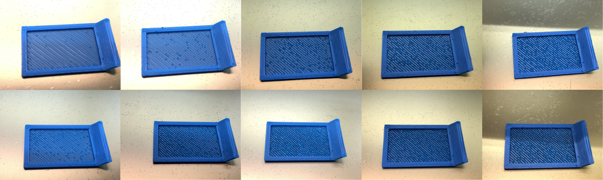
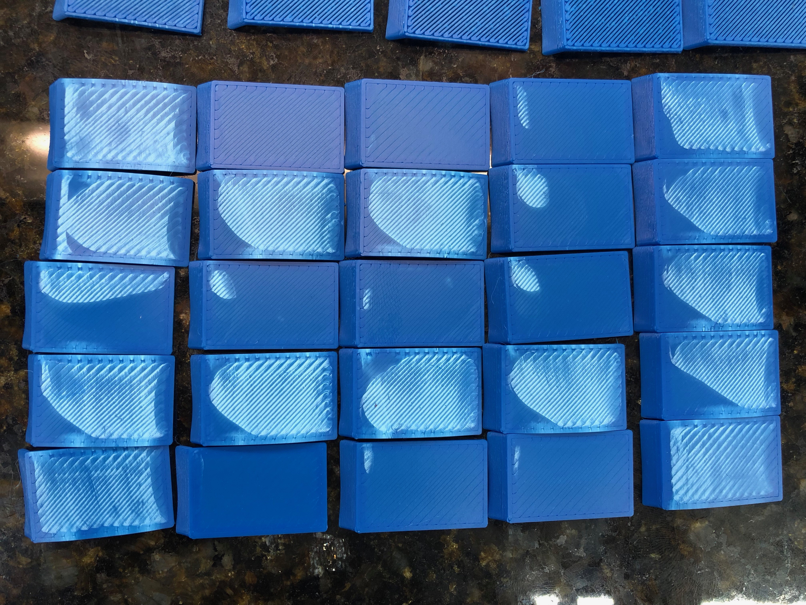
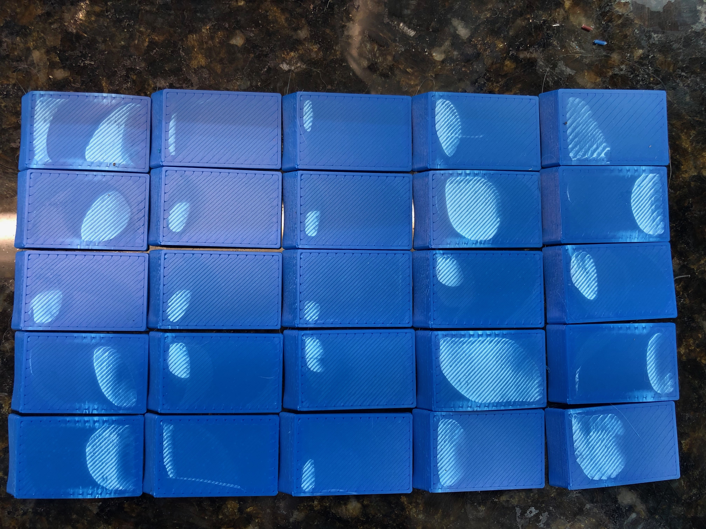
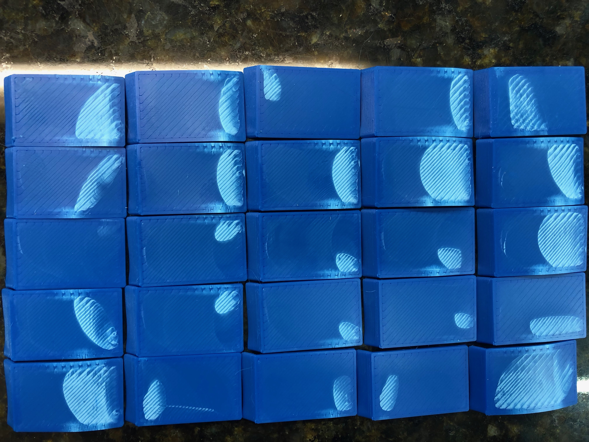
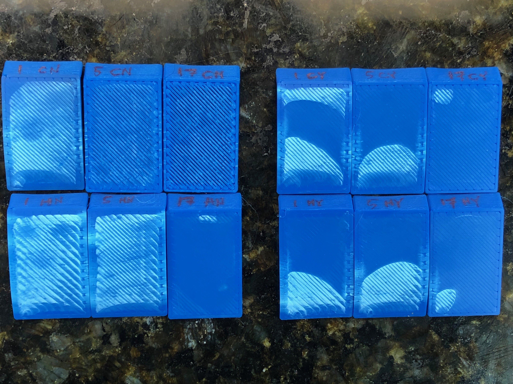

# Setting up thermal compensation

## Hardware

There needs to be some way to measure the temperature of the frame. I took a little bead thermistor I had laying around and shoved it about halfway up the inside of one of my vertical extrusions, using the bottom blind joint access hole to get into the center channel. I connected this thermistor to the T2 thermistor input on my mainboard.

## Installing Software

### Measurement script

Clone alchemyEngine's measurement script from the [Gist](https://gist.github.com/alchemyEngine/6d42bb1ea391bf5d587625d64e5acfe7):

```
cd ~
git clone https://gist.github.com/alchemyEngine/6d42bb1ea391bf5d587625d64e5acfe7
mv 6d42bb1ea391bf5d587625d64e5acfe7 frame_expansion
```

### Update Klipper version

Because the changes haven't yet been merged into the main Klipper fork, we will need to check out alchemyEngine's work-in-progress fork.

Checkout alchemyEngine's Klipper fork:

```
cd ~/klipper
git remote add alchemyEngine https://github.com/alchemyEngine/klipper.git
git fetch alchemyEngine
git checkout -b frame_expansion alchemyEngine/work-frame-expansion-20210410
```

This creates a new branch called `frame_expansion` and updates it to match alchemyEngine's. Our starting Klipper software remains in the `main` branch. 

If we want to pull in further main-branch Klipper updates, we first need to make sure we have it on our list of remotes:

```
cd ~/klipper
git remote -v
> alchemy	https://github.com/alchemyEngine/klipper.git (fetch)
> alchemy	https://github.com/alchemyEngine/klipper.git (push)
> origin	https://github.com/KevinOConnor/klipper.git (fetch)
> origin	https://github.com/KevinOConnor/klipper.git (push)
```

If things look like this, you're good to go:

```
cd ~/klipper
git fetch origin
git pull origin master
```


### Flash updated firmware

Now, we need to update the firmware on our MCU to match our new Klipper software.

```
cd ~/klipper
make menuconfig
make clean
make
```

This will recompile the firmware. Flashing to the MCU will be different depending on your particular board. I'm running a FYSETC Spider in UART mode, and here is what worked for me:

```
sudo service klipper stop
./scripts/flash-sdcard.sh /dev/ttyAMA0 fysetc-spider
sudo service klipper start
```

### Update Klipper config

Our new branch now recognizes a config section called `[frame_expansion_compensation]`. We'll need to fill in some details. 

Because I am using a non-standard thermistor, I also needed to define a custom thermistor type (in my case, an NTC 50K B3950). 


```
[thermistor ntc_50k]
temperature1: 25
resistance1: 50000
beta: 3950

[frame_expansion_compensation]
coeff: 23.4
#   Coefficient of linear expansion for the frame material [μm/m·°C].
#   E.g. 23.4 μm/m·°C for Misumi A6N01SS-T5 6005A-T5 aluminum alloy.
frame_z_length: 530
#   Total length of vertical extrusions [mm].
gantry_factor: 1
#   Relationship between gantry expansion and toolhead Z movement.
#   Examples:
#      if 1mm expansion moves toolhead up 1mm, gantry_factor: 1.0
#      if 1mm expansion moves toolhead up 0.5mm, gantry_factor: 0.5
#      if 1mm expansion moves toolhead down 1mm, gantry_factor: -1.0
#   The default is 1.0.
#max_comp_z:
#   Disables compensation above this Z height [mm]. The last computed correction
#   will remain applied until the toolhead moves below the specified Z position
#   again. The default is 0.0mm (always on).
#max_z_offset:
#   Maximum absolute compensation that can be applied to the Z axis [mm]. The
#   default is 99999999.0mm (unlimited).
sensor_type: ntc_50k
sensor_pin: PC2
min_temp: 0
max_temp: 100
#   See the "extruder" section for the definition of the above
#   parameters.
gcode_id: frame
#   See the "heater_generic" section for the definition of this
#   parameter.
z_stepper: stepper_z
#   The Z stepper motor linked with the Z endstop, as written in printer.cfg.
#   Used for triggering reference temperature measurement. Usually 'stepper_z'
#   unless otherwise defined.
```

There are also some other changes I made to my config to match the measurement script's assumptions. It is looking for a temperature sensor called `chamber`, and I had mine set up as a heater; so I went ahead and redefined it as just a sensor, and commented out the heater code block:

```
#####################################################################
#   Chamber Heater
#####################################################################
# [heater_generic chamber]
# ##  24V heated bed mosfet
# heater_pin: PB4
# sensor_type: NTC 100K MGB18-104F39050L32
# sensor_pin: PC1
# ##  Adjust Max Power so your heater doesn't warp your bed
# max_power: 1
# min_temp: 0
# max_temp: 70
# control: pid
# pid_kp: 10
# pid_ki: 1
# pid_kd: 900


[temperature_sensor chamber]
sensor_type: NTC 100K MGB18-104F39050L32
sensor_pin: PC1
min_temp: 0
max_temp: 70
gcode_id: chamber
#   See the "heater_generic" section for the definition of this
#   parameter.
```

## Run measurement script

Now we can actually measure the thermal expansion!

First, we'll update some parameters in the script to match our printer. You can use `nano measure_expansion.py` or whatever.

Here's mine:

```
######### META DATA #################
# For data collection organizational purposes
USER_ID = 'whoppingpochard#2514'            # e.g. Discord handle
PRINTER_MODEL = 'voron_v2_350'      # e.g. 'voron_v2_350'
MEASURE_TYPE = 'nozzle_pin'       # e.g. 'nozzle_pin', 'microswitch_probe', etc.
#####################################

######### CONFIGURATION #############
BASE_URL = 'http://127.0.0.1'       # printer URL (e.g. http://192.168.1.15)
                                    # leave default if running locally
BED_TEMPERATURE = 105               # bed temperature for measurements
HE_TEMPERATURE = 100                # extruder temperature for measurements
MEASURE_INTERVAL = 1.               # measurement interval (minutes)
N_SAMPLES = 3                       # number of repeated measures
HOT_DURATION = 3                    # time after bed temp reached to continue
                                    # measuring, in hours
COOL_DURATION = 2                   # hours to continue measuring after heaters
                                    # are disabled
MEASURE_GCODE = 'G28 Z'             # G-code called on repeated measurements, single line/macro only
# chamber thermistor config name. Change to match your own, or "" if none
# will also work with temperature_fan configs
CHAMBER_CONFIG = "temperature_sensor chamber"
#####################################

```

I verified that everything started up as expected, then I SSH'd into the Pi and ran the script:

```
cd ~/frame_expansion
python3 measure_expansion.py
```

It's running now!

# Exploring measurement data

My first measurment run yielded a somewhat non-linear relationship between frame_temp and the observed Z offset:



After some discussion about how Klipper handles thermistors, I thought it would be sensible to see if re-running the measurement using a three-point definition rather than a beta definition would improve the fit. It did!

Thus, I changed from this:

```
[thermistor ntc_50k]
temperature1: 25
resistance1: 50000
beta: 3950
```

To this:

```

[thermistor ntc_50k]
temperature1: 25
resistance1: 50000
temperature2: 65
resistance2: 10095
temperature3: 100
resistance3: 3090
```

Turns out that was the ticket!



[Doing some calculations](./gantry_factor_calc.html), I was able to derive 2.8 as an approximate gantry factor for continued testing:



# Print tests

## Test configuration

To actually test the impact of the frame_compensation feature on first-layer printing, I made up a little test object that gives me a top and bottom view of the first layer, while also being easy to pull off the printbed when finished. I  then sliced a print of 25 copies of the model spaced across the bed and set to print each sequentially, rather than layer-by-layer. I also manually set the order, so that it would print row-wise across the plate:



I set my slicer start gcode to include a 15-minute heat soak after achieving bed temperature, and then to either disable or enable frame compensation, depending on the run.

I ran the following tests:

- printing from cold, no compensation
- printing from cold, with compensation
- printing from hot, no compensation
- printing from hot, with compensation

"from hot" prints were run as quickly as possible after the "from cold" prints.

## Results: Cold start, no compensation

You can clearly see a decreasing amount of "squish" in the first layer across the first 7 or 8 test samples, representing maybe 20 minutes of print time:



This is even more apparent if you flip them over and look at the underside:


## Results: Hot start, no compensation

As we'd predict, the results are more more consistent for the hot start. Presumably, the frame has already reached equilibrium. There may be some variation in squish, but I don't think there's enough to say that the pattern we saw in the cold start is actually the result of a mechanical issue:



## Results: Cold start, with compensation

This one pretty much seals the deal for me. Despite identical cold-start parameters as the first test print, we see a really consisten first layer across the build plate, start to finish:



## Results: Hot start, with compensation

Including frame compensation from a hot start didn't seem to have any negative consequences, and the layer looks fairly consistent across the print. I think the overall degree of "squish" ended up being a little greater for both hot starts with and without compensation, but including the compensation didn't send the nozzle crashing into the bed or anything!



## Results: comparisons

Finally, I pulled out just the 1st, 5th, and 17th (bed center) test pieces from each trial and put them together for a visual comparison.



I think this really summarizes things nicely! 

I also hit the bottoms of the pieces with a heat gun and grouped them per-position rather than per-run, to highlight how the test piece printed at the same bed location fared across different trials. 


# Conclusion

This shit absolutely rules, and thanks so much to alchemyEngine for all the hard work!

