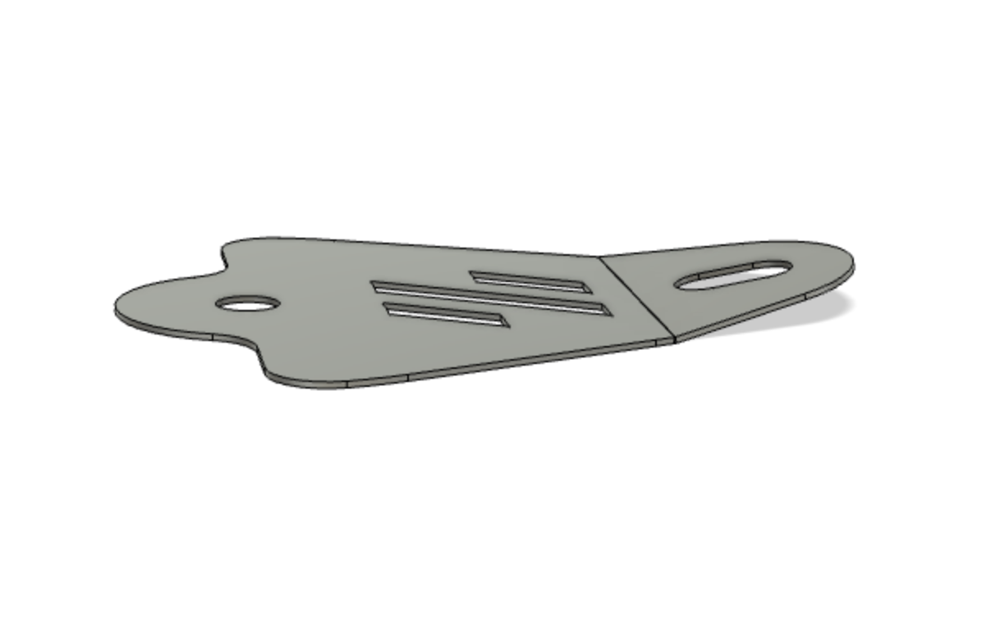

# Laser cut kinematic bed mounts, Beta 1

## Assembly

### Step 0 (optional): pre-bend leaf spring

You can optionally pre-bend the end of the leaf spring to allow it to slide a little more easily under preload. There are bend relief cuts to help this. Try clamping the main body of the spring in a vise right below the relief cut, and then grabbing the tip just above that with wide pliers and slowly bending. Aim for about 10 degrees.

### Step 1: Assemble bed mounts

Attach the leaf spring to each of the three mount points on the bed (front left and right standard V2 mount points, rear center mount point) using an apporpriate length M3 SHCS for your bed and a hex nut, as shown. There should be 2 to 3 mm of threads protruding from the hex nut. The nut should be pretty tight. 

Now, thread the spherical nut on until it bottoms out on the hex nut. This can be just finger tight.

### Step 2: Assemble front mount

First, sandwich two M5x16 dowel pins together and secure with M3x10 BHCS + M3 hex nuts. Tighten maybe 1/2 turn past finger snug. 

Next, use the M3x12 BHCS to loosely attach hammer tnuts as shown.

Finally, line the bottom front piece square against the front edge of the extrusion, and tighten M3x12 BHCS.

Repeat for other side.

### Step 3: Assemble rear mount

The rear mount has some pilot holes cut on the flanges. If you want, you can drill these out with a 2.5 mm bit and tap with M3 to attach wago mounts or other things.

Make a sandwich with the M5x16 dowel pins as shown, using 4 M3x10 BHCS and M3 hex nuts.

Next, loosely add the remaining four M3 tnuts:

Position the rear mount on the bed support extrusions so that it's approximately in position of the rear of the bed, but do not tighten the screws.

Now, you can place the bed onto the mounts and do precise alignment. Move the rear mount so that it is parallel to the back of the bed, and the ball sits approximately in the center of the hole. Then tighten down the four tnuts.

### Step 4: Preload leaf springs

The bed is now kinematically coupled to the frame. It should feel *very* secure, with no wiggle in lateral motion. However, it is only being held in place by gravity at this point.

To securely attach the bed, but still leave room for expansion, use the M3x6 SHCS to secure the tip of the leaf springs into the threaded hole at the end of each mount. Bend the spring down with your finger, and thread the screw into the hole.

Tighten the preload screw down until you're happy with it. If you pre-bent the spring to 10°, it should be roughly parallel to the mount. This should give somewhere around 3-4 kg of preload per mount:

This should be plenty to keep the bed securely in place, even when flipping the machine over; but not so much that the balls can't move with thermal expansion of the bed. ***Do not tighten the preload screw all the way down!***