# Laser cut kinematic bed mounts

## The theory

Kinematic couplings are a really neat engineering solution to two problems associated with precisely connecting thing A to thing B:

- how can I detach and re-attach thing A, and be sure it's in *precisely* the same place?
- how can I assure precise alignment even if things A and B are slightly changing size (for example, due to thermal expansion)?

They do this by *exactly* constraining the 6 degrees of freedom between the two objects, and not *over* constraining any beyond that. (For a really excellent hands-on demenstration of what this means, I strongly recommend nickw's [fantastic tutorial](https://pinshape.com/items/36874-3d-printed-an-introduction-to-kinematic-coupling) on Pinshape.) 

Exact constraint means that there is one and only one orientation in which things A and B can be connected. If you remove them and re-attach, they will retun to that *exact* orientation relative to one another. If thing A expands slightly with respect to thing B, there will still be one and only one orientation aligning them, even though the three connection points on thing A are now slightly farther apart. 

If we are clever about how we organize the constraints, we can even make sure that the new orientation, post-expansion, keeps a target point on thing A exactly where it was pre-expansion. There are two common types of kinematic couplings, which differ primarily in *where* that stationary target point is located.

### Kelvin's kinematic coupling

A Kelvin-style kinematic coupling uses three points of contact, each constraining a different number of degrees of freedom of motion. The first point is often formed by three angled faces contacting a sphere; these three contact points restrict three degrees of freedom (translation in X, Y, and Z), but still permit it to rotate about each axis. The second point is formed by two angled faces or rods contacting a sphere, which constrain two DOF, but still permit expansion along the axis pointing towards contact point 1. The final point is formed by a single face contacting a sphere, and hence only constraining it in Z; the sphere can still slide along the face in two dimensions. In total, we now have 3 + 2 + 1 = 6 constraints on the orientation of thing A (sphere contacts) with respect to thing B (face contacts). If thing A expands slightly, the sphere at contact point 2 can slide along the rods away from contact point 1, and the phere at contact point 3 can slide along the flat face away from both contact points 1 and 2. But for any given distance between the three spheres of thing A, there is one and only one orientation where they can be in contact with all six contact surfaces of thing B. Neat! 

As you can see in the diagram, because contact point 1 is constrained in all three dimensions, that point will remain stationary on thing A with respect to thing B as thing A expands or contracts.

### Maxwell's kinematic coupling

Maxwell's kinematic coupling is similar to Kelvin's coupling, except that each point of contact constraints two degrees of freedom. This usually takes the form of three sets of parallel pins or angled faces on thing B, oriented radially around the center, each making two points of contact with a sphere on thing A. As you can see in the diagram, this means there are now 2 + 2 + 2 = 6 total constraints, and we are exactly constrained, as with the Kelvin coupling.

Unlike the Kelvin coupling, though, *each* contact point is now free to move along one (and only one) axis as thing A expands relative to thing B. That means that the stationary point is no longer one of the contact points, but is instead some place in between the three contacts. If the three contact points are arranged at 120° to one another, the stationary point will be precisely at the intersection of the three parallel contacts. This is a useful characteristic if you want to mount something like an optical element precisely in the center of a base, and is thus the most typical arrangement for Kelvin style couplings. 

### Kinematic couplings on 3D printers

Most commonly we see kinematic couplings on 3D printers in two places: at the toolhead connection to the carriage on toolchanging printers, and between the bed and the frame on any printer using a heated bed. Each of these applications takes advantage of a different one of the two nice properties of kinematic couplings outlined above: for toolchangers, allowing toolheads to be attached and detached without needing to measure new offsets; and for beds, to allow the bed to expand without inducing any forces on the frame that might lead to it warping or going out of parallel with the XY motion axes. 

For the latter application, Mark Rehorst has [a really excellent blog post](https://drmrehorst.blogspot.com/2017/07/ultra-megamax-dominator-3d-printer-bed.html) describing his original DIY kinematic bed mounts that I strongly suggest you check out---it is definitely what got me excited about implementing them!

For the Voron V2.4, the stock bed is rigidly mounted to two extrusions using knurled nuts as standoffs. Right away you can see that this is overconstrained, as each tight screw connection by itself constrains six degrees of freedom: all three translational DOF as well as three rotational DOF (or, at bets, 2 rotational DOF, if we assume the parts can still rotate about the screw). That's 5 + 5 + 5 + 5 = 20 constraints! If the bed wants to expand more than the extrusion, there's no where for the metal to go that doesn't induce a deflection in the plate.

You can see this illustrated clearly using a finite element analysis simulation of the V2.4 heatbed, in which we've fixed the contact point betwen the bed and the standoffs. When the plate heats it wants to expand, but the restriction of the four tight screws prevents it, forcing it to bow upwards into a saddle shape. 

Tacos, anyone?

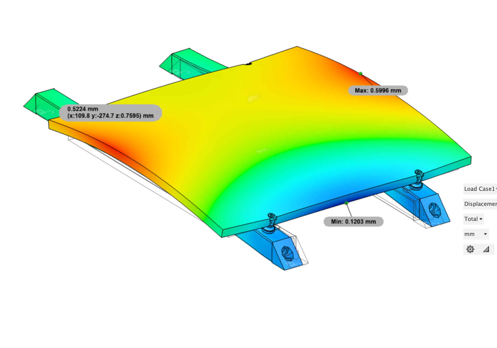

The typical advice given is to reduce this overconstraint by only using three mounts, or only tightening three screws, or tightening one just screw and leaving the others snug or loose.

It's hard to model 'snug' using FEA in Fusion360. But we can at least simulate the three tight/one loose (i.e. constrained only in Z) screw. But already we can tell that the system is still over-constrained, with 5 + 5 + 5 + 1 = 16 DOF constraints. And indeed, the simulation shows a tilt in the bed as it heats:

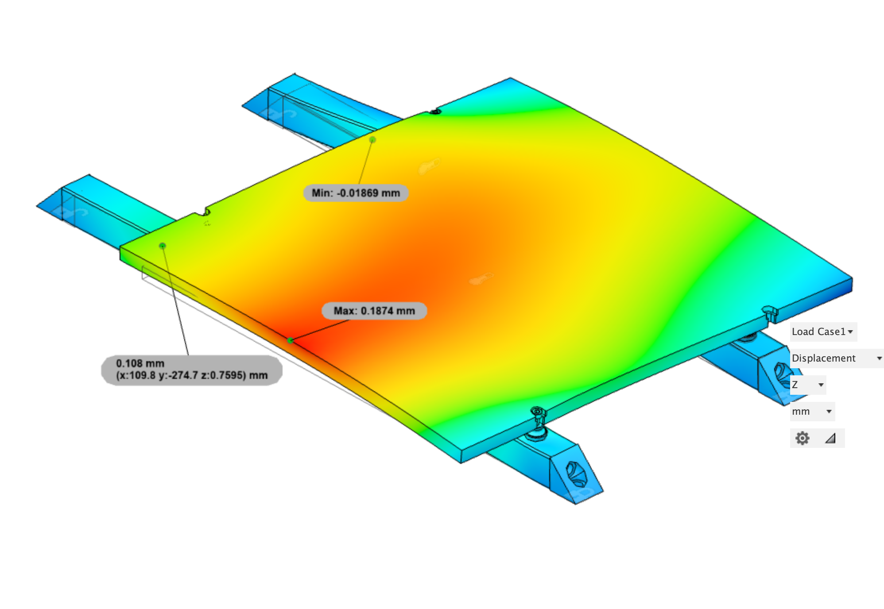

In fact, it is this tilt that got me excited about kinematic bed mounts for the V2.4, as we kept seeing something like it popping up in our thermal expansion datasets, even after installing [gantry backers](../extrusion_backers):

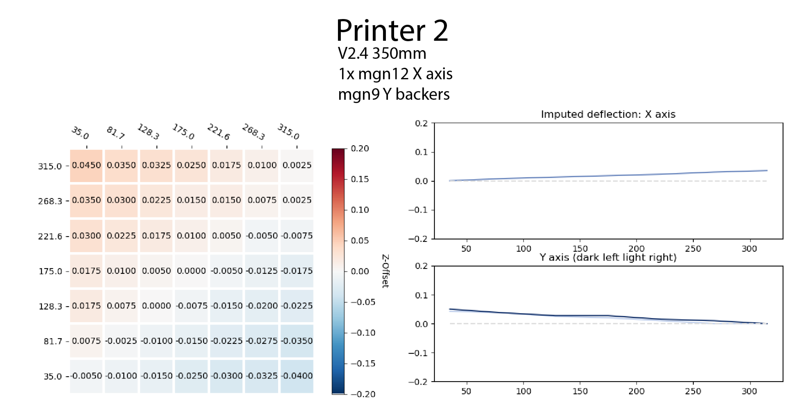

That tilt often seemed to disappear when loosening all four screws, suggesting that it was a product of bed overconstraint. 

Let's fix that!

## Laser-cut kinematic mounts

Here is my take on a Maxwell-style kinematic mount for the Voron 2.4 bed:

### Design goals

Beyond simple functionality, I had a few things I wanted to achieve with these mounts.

- **All-metal construction.** Printed designs exist, but I have heard mixed results about their longevity and accuracy. Metal is fun!
- **Ease of manufacture.** I wanted something that was relatively easy and inexpensive to manufacture; i.e., could be ordered directly from SendCutSend or a similar laser cutting service. It's not *quite* RepRap, but it should make it more accessible to more people!
- **Positive bed retention.** I flip my V2.4 a lot to poke around in the electronics bay. While a lot of 3D printer kinematic mount designs use magnets, and magnets are indeed awesome, the prospect of 2 kg of expensive aluminum bed suddenly crashing out of the magnets because I forgot to secure it was... not appealing. I'm an idiot and I would *absolutely* do this.
- **Minimal loss of Z.** I'd like to retain as much Z capacity as possible.

After a lot of design and experimentation, and a few rounds of beta testing, this is the result! 

### Features

- **Maxwell-style laser-cut mount.** Maxwell-style mounts are challenging to machine manually, but a cinch to do on a laser cutter. These mounts use two laser-cut aluminum pieces to clamp steel dowel pins for each parallel contact point.
- **Positive bed retention using leaf springs.** By using laser-cut leaf springs to preload the bed against each mount, we can be sure that the bed is retained in the event of a Z axis inversion. Also: logo, natch.
- **Integrated rear cross-support piece.** With a bent-aluminum rear support element, we can leave some room for wires to pass while retaining plenty of support for the center contact point. Tapped holes also give a place to attach Wago mounts or other bits and pieces.
- **Just 8mm loss of Z.** The whole stack moves the bed up about 8mm. 
- **Compatibility with stock Z endstop location.** Adding cutouts in the rear support piece allows us to install without moving the Z endstop to the other side of the extrusion, and is also compatible with other popular mods with hopefully minimal redesign necessary.

### The data

To test the mounts, I used my and Alch3my's measure_thermal_behavior.py script to take bed meshes before and after heating the bed. The protocol homes, does a QGL on the cold bed, homes again, and then takes a mesh of the cold bed. It then heats the bed, lets it soak for five minutes, and takes another mesh with the bed hot. (I leave the doors open to minimize the potential impact of frame heating on results.) The heatmaps below show the *change* in the mesh from a cold bed to a hot bed.

Here is what my bed looks like with stock bed standoffs, all four screws tight: 

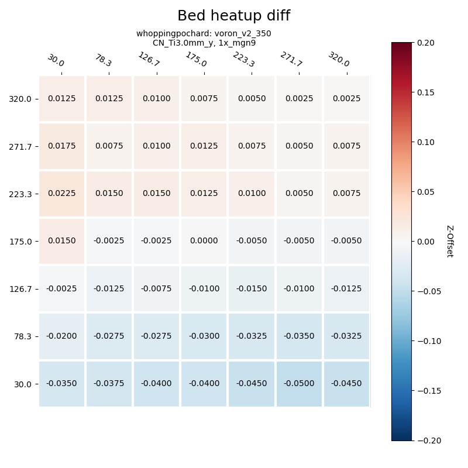

You can see that heating the bed induces about a 0.06 mm curvature/tilt across the bed, with a low point along the front and a high point in the center-back---consistent with our FEA modeling! (Note that the *absolute* deviation is likely greater than this, as the Z endstop is *also* likely deflecting upwards as the bed heats and bows the extrusion on which it is attached.)

Here is what it looks like with the stock standoffs, in the one-tight, two-snug, one-loose arrangement:

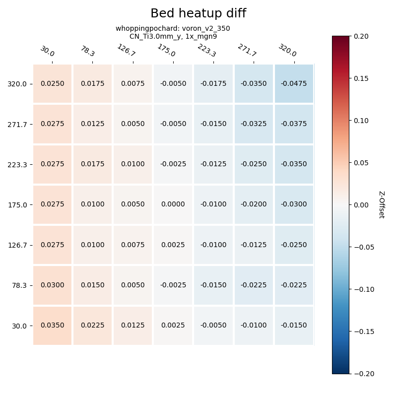

Now there is still a tilt, it is just reoriented---again, consistent with the predictions from modeling.

#### Evidence for the efficacy of kinematics mounts:

Finally, here are my results using the laser cut kinematic mount:

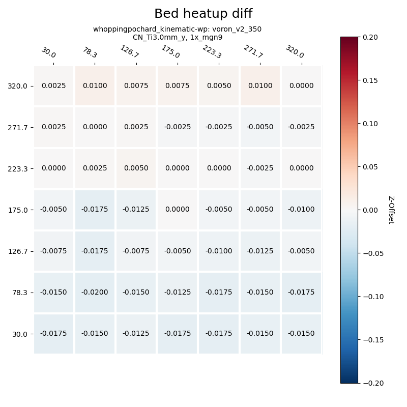

I've also gotten some data from beta testers. Here is data from two testers whose mounts worked as expected, along with my data:

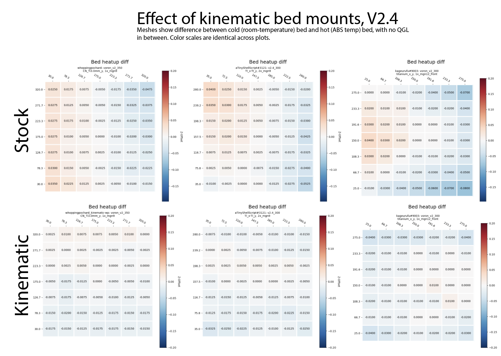

In each case, the kinematic mounts resulted in a lower total deviation in the plane of the bed after heating. 

#### Evidence against

We have also encountered some cases where the kinematic mounts *do not* appear to have resulted in improvements, and it is important to post those results here as well. 

In one case, where the printer is using a rolled rather than cast aluminum build plate, *less constrained* mounting always seemed to result in a similar 'twist' deformation of the plate on heating, that wasn't present in the over-constrained scenario. This is especially apparent when comparing the three meshes directly, rather than the mesh differences as displayed above:

Our interpretation is that cast aluminum plates really are more dimensionally stable when heated, and the rolled plate on this printer is twisting as it heats. I'm very interested in pursuing more data comparing rolled and cast build plates to see if this is consistent!

### Do I need them?

No! Obviously people have been making beautiful prints on V2.4s for years. You do not *need* kinematic mounts. Furthermore, unlike the case of bimetallic expansion in the gantry, which takes a very long time to heat soak to the point where a bed mesh can fully compensate for it, the majority of the bed deflection from overconstraint likely occurs as the bed heats up, and hence can be corrected for with a mesh taken after heating. It also appears to generally be of lower absolute magnitude than the effect observed from bimetallic expansion.

You might still find that they offer some benefits, though. 

**Consistency/reliability.** Loose (or "snug") screws may loosen over time due to vibrations of the frame. Using kinematic mounts allows you to fully tighten all fasteners and hopefully decrease the likelihood that you find yourself chasing issues with loose screws down the road.

**Thermal stability.** My goal for my own printer is to be as stable across thermal conditions as possible, to increase the reliability of my first layers. I find that using backers and kinematic mounts, I don't see much if any benefit to re-meshing between prints. 

**Bed tacos???** Some suggest that the stresses induced from overconstraint when heating could actually result in permanent deformation of the build plate. I don't buy that, personally: the actual predicted stresses in the plate and extrusions are *well* below the point of plastic deformation in the material, so should not in theory result in permantent deformation. However, if it's something you're concerned with, a kinematic mount should definitely circumvent the potential for this kind of thing. 

### But I *want* them

Me too! 

Here are some options:

#### Make them yourself

I've included a BOM with links to the parts I used, as well as the CAD models and DXFs for laser cutting and bending. In the US, SendCutSend will do both the laser cutting and the bending at very reasonable cost.

#### Purchase a kit

I have contracted with a manufacturer to offer kits, which I am making available through various Voron-trusted resellers. Unlike with extrusion backers, I am making a small profit off of these kits. If you'd like to support us, you can grab one from any of the following vendors:

US:

- [DFH](https://www.deepfriedhero.in)
- [Fabreeko](https://www.fabreeko.com)
- [West3D](https://www.west3d.com)
- [3Dmakerparts](https://3dmakerparts.com)

EU:

- [Lecktor](https://www.lecktor.com)

UK:

- [Printyplease](https://www.printyplease.uk)

### Alternatives

There is more than one way to feed a cat!

If you want an alternative kinematic mount, [MandalaRoseWorks](https://mandalaroseworks.com/products/matched-height-kinematic-kit) makes a gorgeous US-made, CNC-machined Kelvin-style kinematic mount for Vorons.

There are other non-kinematic approaches that may also work well. Compliant mounts are one such option. In my testing, the flexible silicone spacers that are often used as an alternative to bed springs performed similarly to kinematic mounts in reducing deflection on bed heatup, as the flexible silicone took up all the deformation from bed expansion.

Plastic standoffs may also work similarly. Printed high-temperature plastic standoffs, in conjunction with PEEK screws, could very well do the trick, as they are strong but still more flexible than aluminum. FEA simulation results indeed show decreased deformation versus steel mounts, and I have seen one dataset so far showing a substantial improvement and one dataset showing little improvement. I hope to collect more data from this arrangement and update this soon!

## Assembly

### Step 1: Assemble bed mounts

Attach the leaf spring to each of the three mount points on the bed (front left and right standard V2 mount points, rear center mount point) using an apporpriate length M3 SHCS for your bed and one of the included thin hex nuts, as shown. There should be 2 to 3 mm of threads protruding from the hex nut. The nut should be pretty tight. 

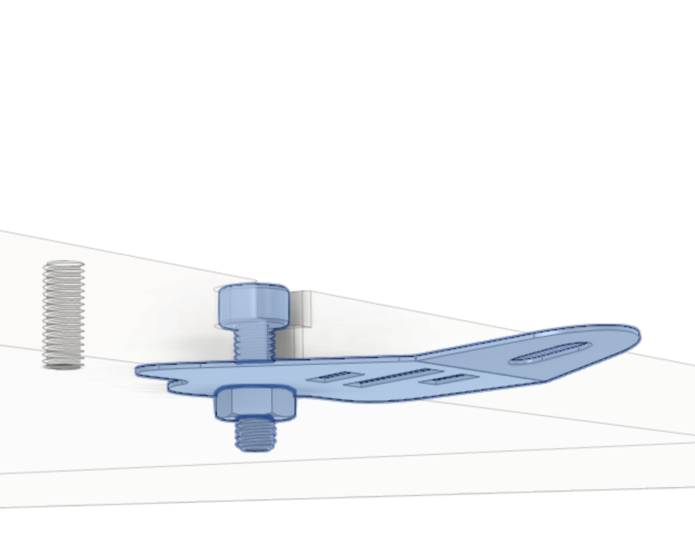

Now, thread the spherical nut on until it bottoms out on the hex nut. This can be just finger tight.

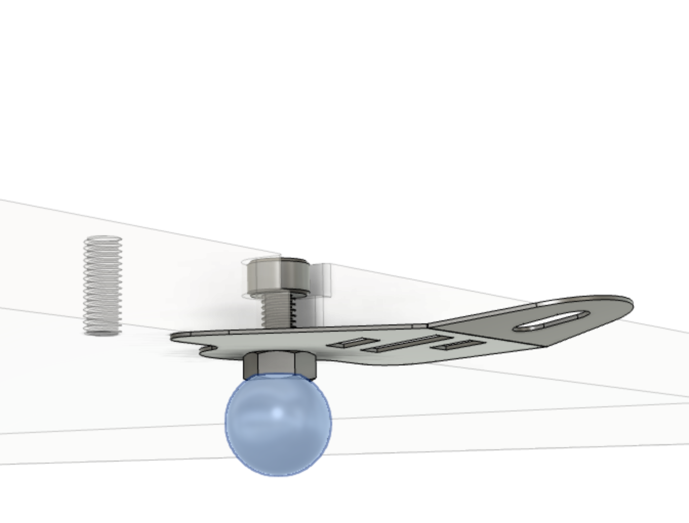

### Step 2: Assemble front mount

First, sandwich two M5x16 dowel pins together and secure with M3x8 BHCS nuts. Tighten maybe 1/2 turn past finger snug. Don't overtighten -- you don't want to strip the aluminum threads!

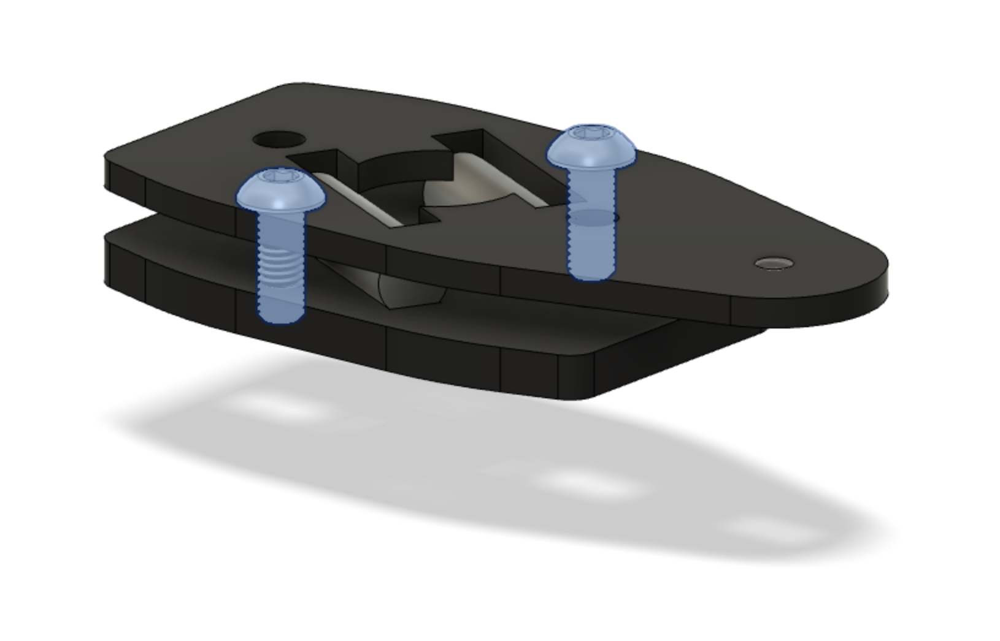

Next, use the M3x12 BHCS to loosely attach a hammer tnut as shown.

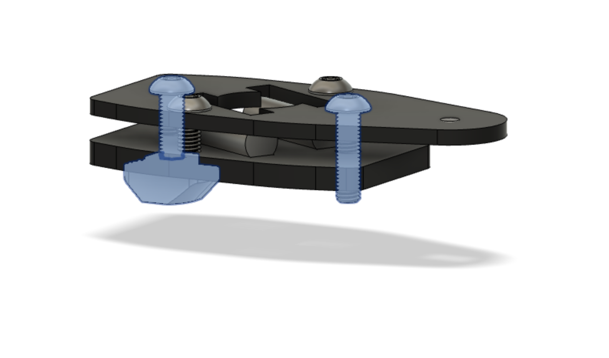

Finally, line the bottom front piece square against the front edge of the extrusion. Use the existing channel nut from the stock mounts for the other M3x12 BHCS, then tighten both of them.

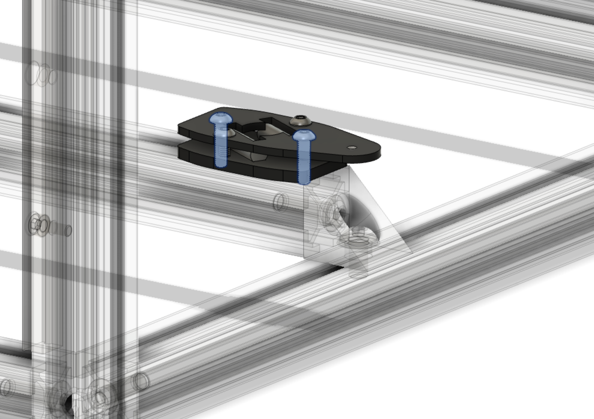

Repeat for other side.

### Step 3: Assemble rear mount

The rear mount has some pilot holes cut on the flanges. If you want, you can drill these out with a 2.5 mm bit and tap with M3 to attach wago mounts or other things.

Make a sandwich with the M5x16 dowel pins as shown, using 4 M3x10 BHCS and M3 hex nuts.

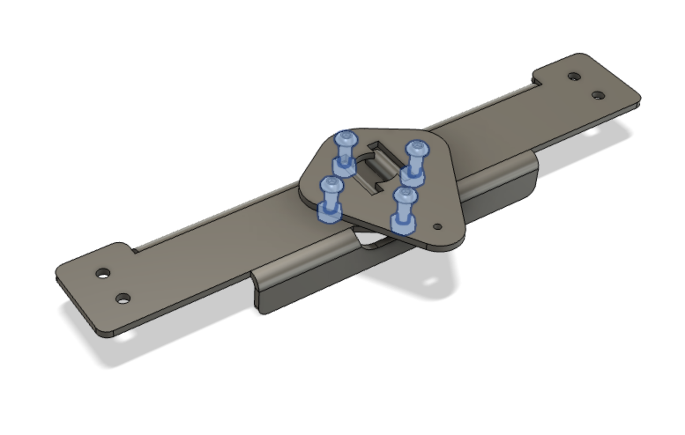

Next, loosely add the remaining two M3 tnuts:

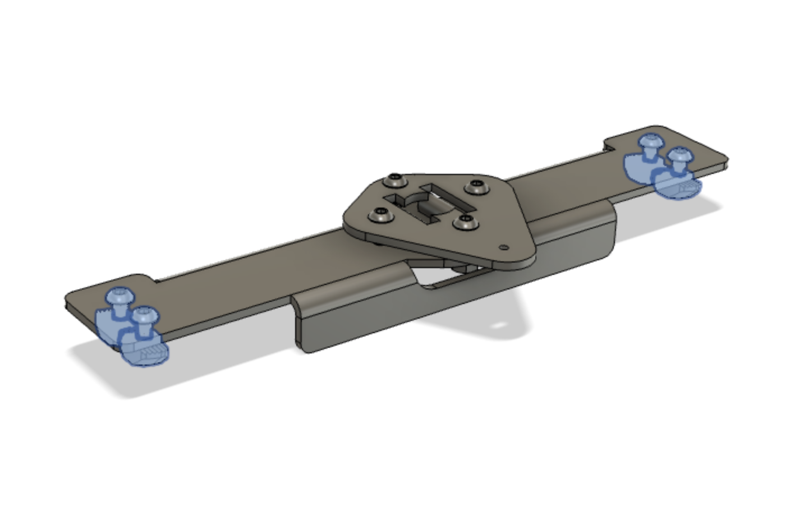

Position the rear mount on the bed support extrusions so that it's approximately in position of the rear of the bed, but do not tighten the screws. Use the two existing channel nuts from your stock mounts for the remaining two screws.

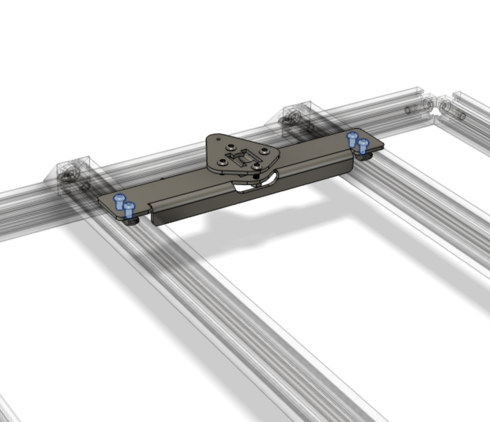

Now, you can place the bed onto the mounts and do precise alignment. Move the rear mount so that it is parallel to the back of the bed, and the ball sits approximately in the center of the hole. Then tighten down the four tnuts.

### Step 4: Align and tighten mounts

This is the most important step to get right: the if the mounts aren't aligned correctly, the sphere nuts will not be able to slide along the dowel pins and your bed has the potential to move!

Make sure the pins are all pointed towards the center, as shown:

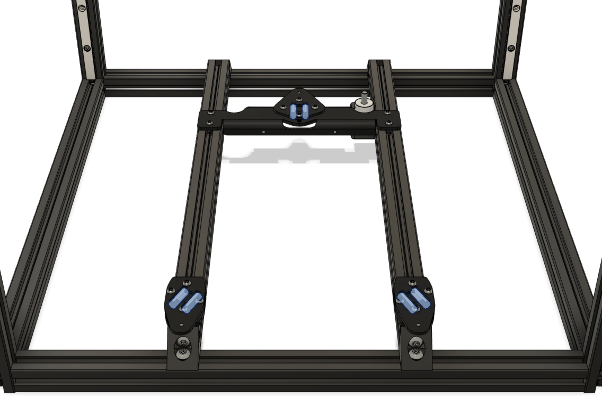

Now, use the bed to find the correct location for the rear mount. You want the rear sphere nut to be centered in the cutout, with the mount running parallel to the back edge of the bed and perpendicular to the bed support extrusions.

You may find that printing three of the "install helpers" will help with this. They fit around the sphere nut to help center it in the cutout.

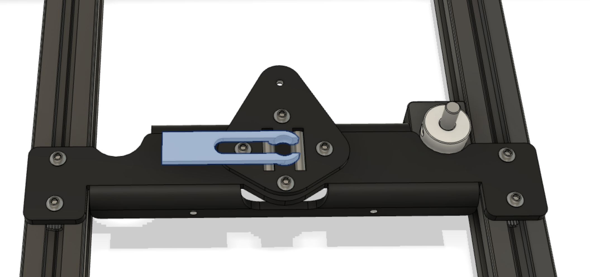

You press the bed down until you're sure the spherical nuts are all indexed against the pins, then tighten the M3x8 BHCS to fix the rear mount. 

If you used the install helper print, remove it now.

### Step 5: Preload leaf springs

The bed is now kinematically coupled to the frame. It should feel *very* secure, with no wiggle in lateral motion. However, it is only being held in place by gravity at this point.

To securely attach the bed, but still leave room for expansion, use the M3x6 SHCS to secure the tip of the leaf springs into the threaded hole at the end of each mount. Bend the spring down with your finger, and thread the screw into the hole.

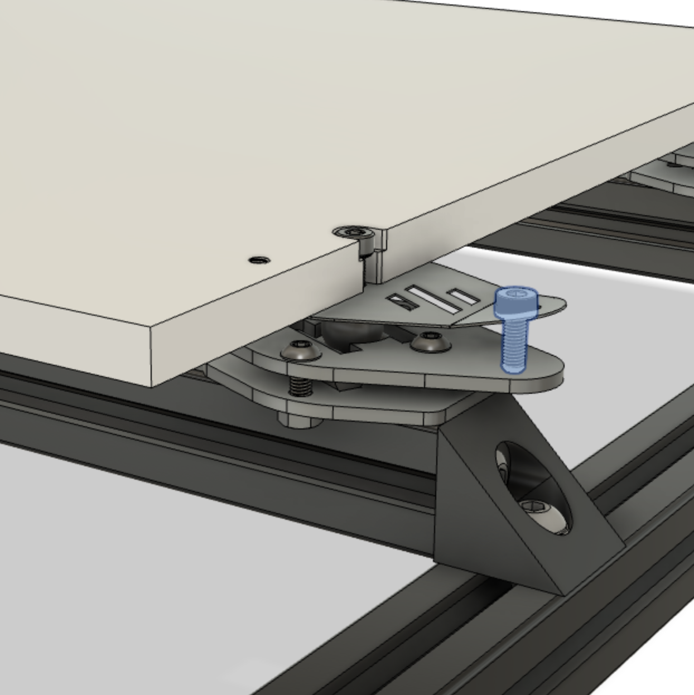

Tighten the preload screw down until you're happy with it. If you pre-bent the spring to 10°, it should be roughly parallel to the mount. This should give somewhere around 3-4 kg of preload per mount:

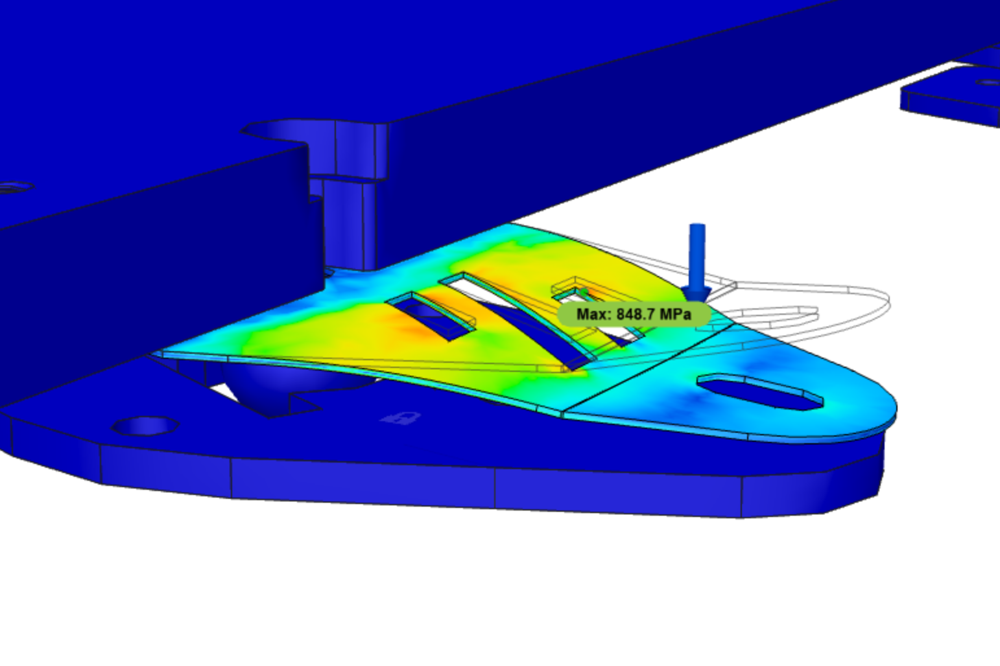

This should be plenty to keep the bed securely in place, even when flipping the machine over; but not so much that the balls can't move with thermal expansion of the bed. ***Do not tighten the preload screw all the way down!***