# Trident kinematic mount assembly

### Step 0: Remove bed assembly from rails

First, disassemble bed and frame from rail mounts and disconnect all electrical connections. (If possible. If not, you can probably do one corner at a time.)

Remove the M5x16 BHCS from the GE5C bearing at each corner, and take the bed off the extrusion mounts.  

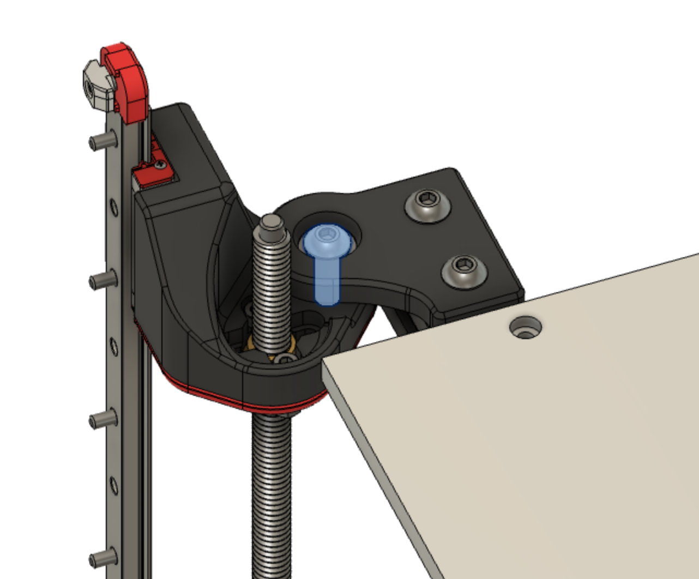

Now, remove the printed GE5C bearing holder from each corner and take out the GE5C bearing.

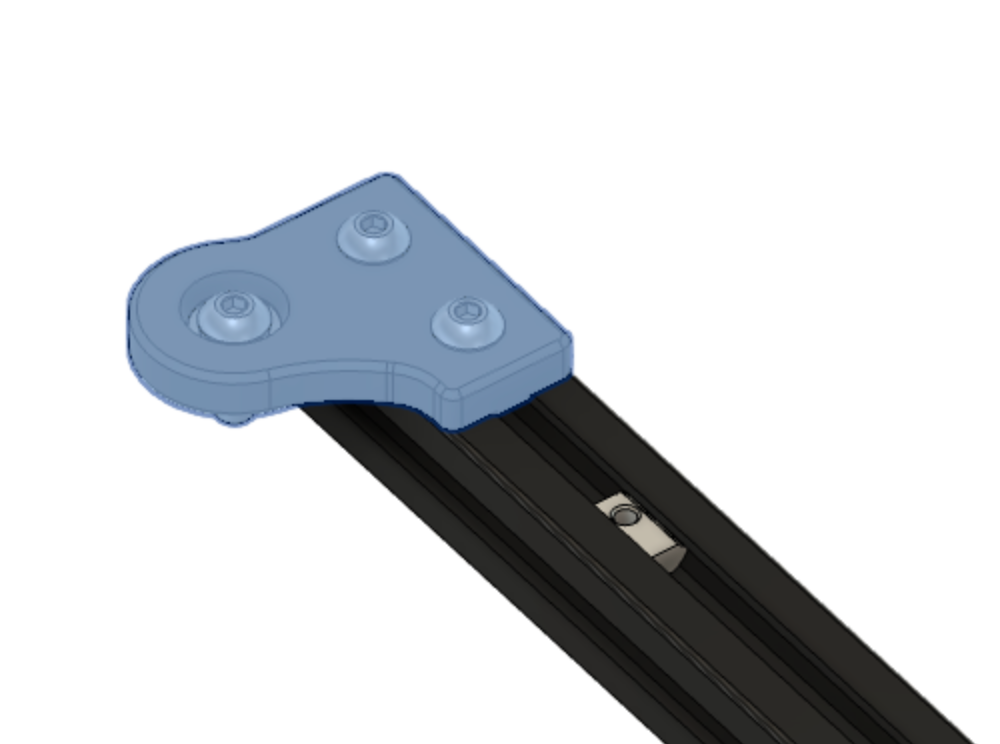

Leave the M5 and M3 channel nuts in place.

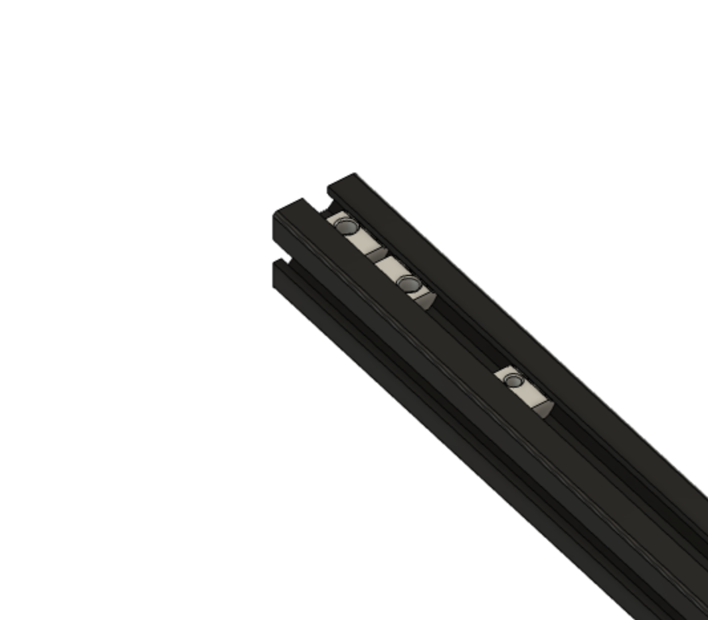

### Step 1: Assemble bed mounts

Attach the leaf spring to each of the three mount points on the bed (front left and right standard V2 mount points, rear center mount point) using an apporpriate length M3 SHCS for your bed and one of the included thin hex nuts, as shown. There should be 2 to 3 mm of threads protruding from the hex nut. The nut should be pretty tight. 

Now, thread the spherical nut on until it bottoms out on the hex nut. This can be just finger tight.

### Step 2: Assemble front metal bearing holders

The Trident kinematics kit also includes all-metal corner bearing holders. First, assemble the bearing retention plate by attaching it with three M3x6 BHCS to the bearing housing plate. Use the outer (farther from center) holes.

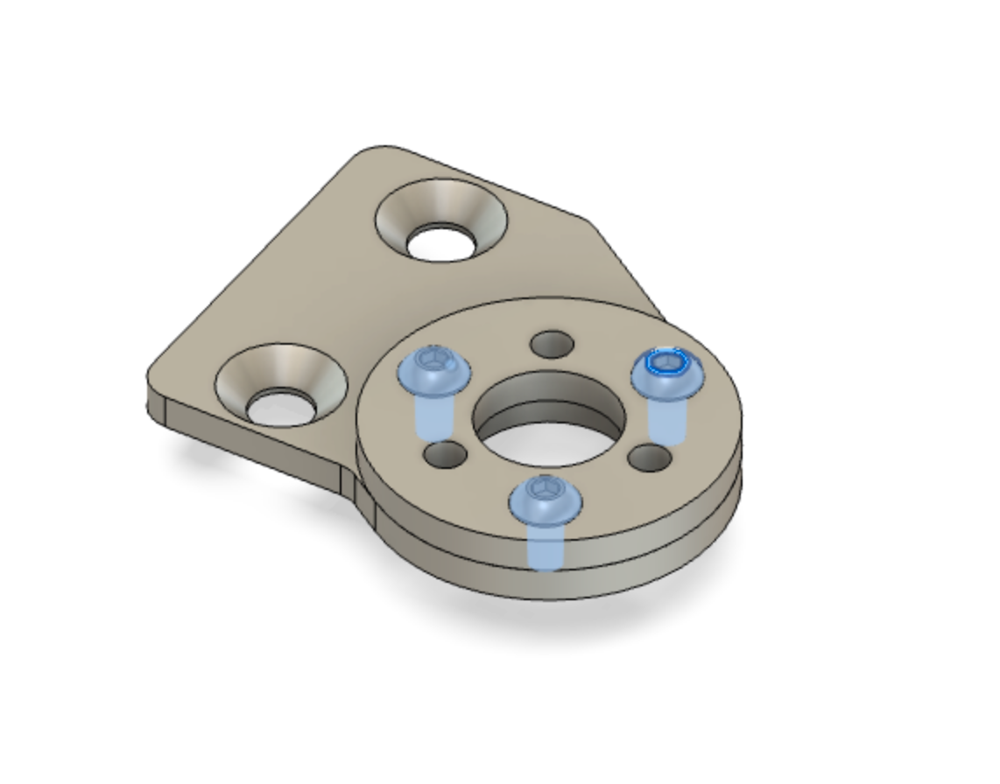

Next, insert the GE5C bearing from below, and secure with three more M3x6 BHCS. Depending on the specific screws, you may need to also add a washer. (These will use flange head screws in the production run.)

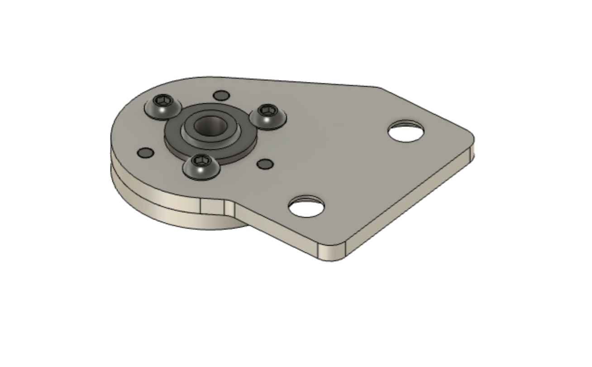

Finally, attach the bearing holder to the bed extrusion using the M5x8 FHCS.

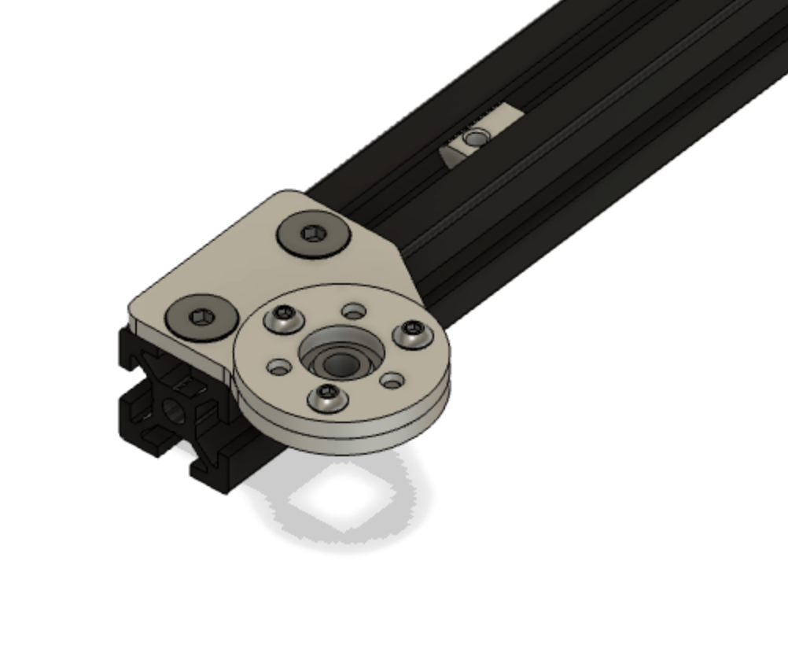

Repeat for other side.

### Step 3: Assemble rear mount

Assemble the bearing retention portion of the rear mount as with the front mounts.

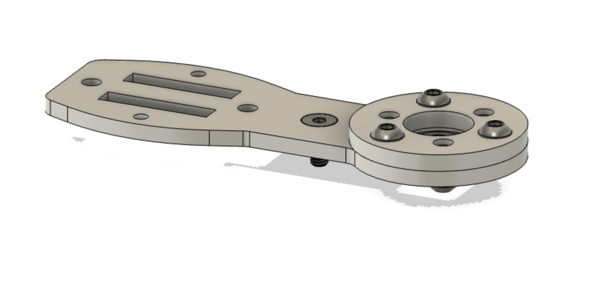

Before attaching to the extrusions, though, complete the kinematic assembly by sandwiching two M5x20 dowel pins between the bottom and top plates, and fastening with M3x8 BHCS in the two outer holes. **Make sure to include the M3x8 FHCS in the countersunk hole prior to assembling.** (Some betas may not have this hole countersunk; this won't interfere with functionality.)

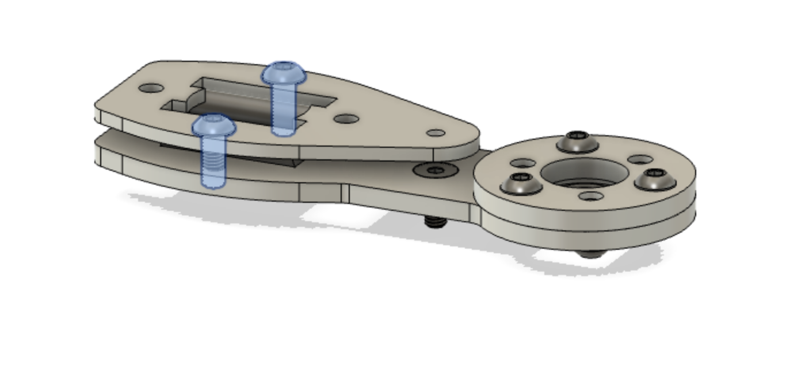

Now, attach the rear assembly to the extrusion. Use three M3 channel nuts, and attach using two of the M3x14 BHCS and the M3x8 FHCS you put in earlier. 

### Step 4: Assemble front mounts

Now, make the front mounts in the same way. First sandwich the dowel pins between the two plates, and secure with M3x8 BHCS in the side holes. 

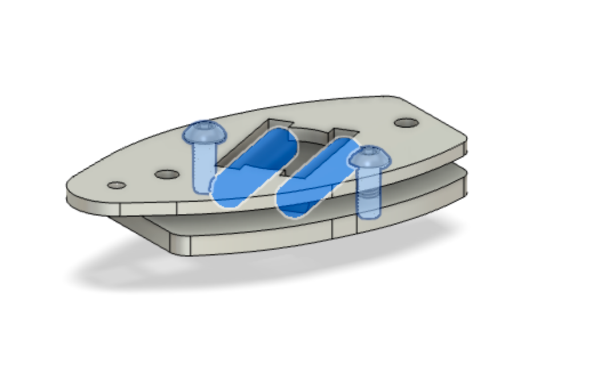

Then you can secure to the extrusions with two M3x14 BHCS. Use the original bed mount channel nut, plus one additional M3 channel nut.

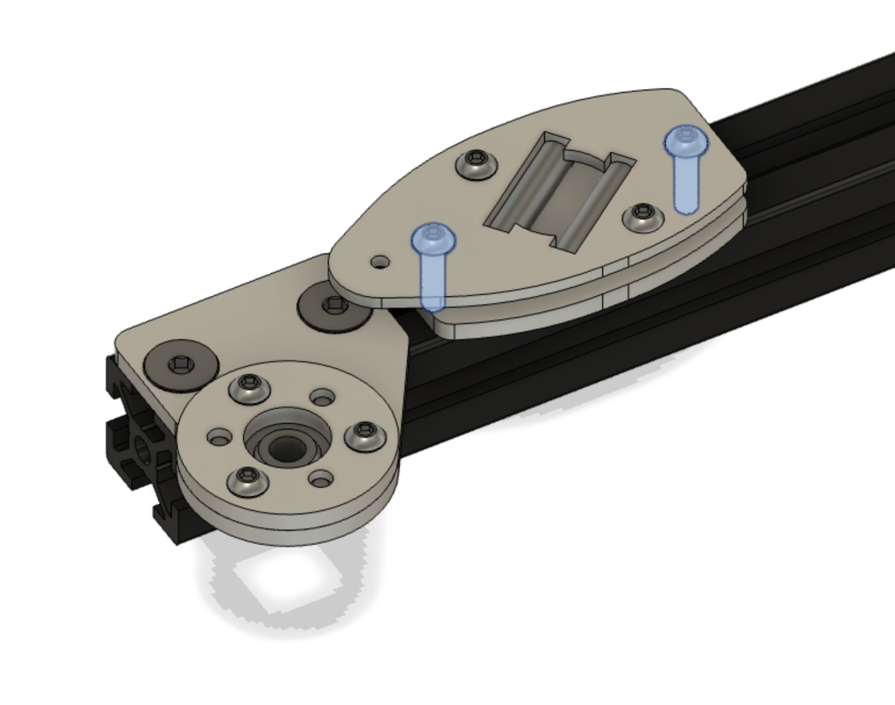

### Step 4: Align and tighten mounts

This is the most important step to get right: the if the mounts aren't aligned correctly, the sphere nuts will not be able to slide along the dowel pins and your bed has the potential to move!

Make sure the pins are all pointed towards the center, as shown:
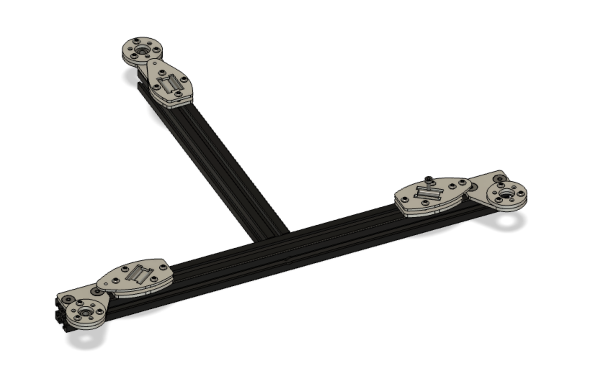

Now, use the bed to find the correct location for the rear mount. You want the rear sphere nut to be centered in the cutout, with the front edge of the bed parallel to the front bed support extrusion.

Press the bed down until you're sure the spherical nuts are all indexed against the pins, then tighten the screws to the mounts. 

### Step 5: Preload leaf springs

The bed is now kinematically coupled to the frame. It should feel *very* secure, with no wiggle in lateral motion. However, it is only being held in place by gravity at this point.

To securely attach the bed, but still leave room for expansion, use the M3x6 SHCS to secure the tip of the leaf springs into the threaded hole at the end of each mount. Bend the spring down with your finger, and thread the screw into the hole.

Tighten the preload screw down until you're happy with it. If you pre-bent the spring to 10°, it should be roughly parallel to the mount. This should give somewhere around 3-4 kg of preload per mount:

This should be plenty to keep the bed securely in place, even when flipping the machine over; but not so much that the balls can't move with thermal expansion of the bed. ***Do not tighten the preload screw all the way down!***

### Step 6: Re-attach bed to carriages

Now you can reattach the whole bed assembly to the Z carriages using the original M5x16 BHCS.

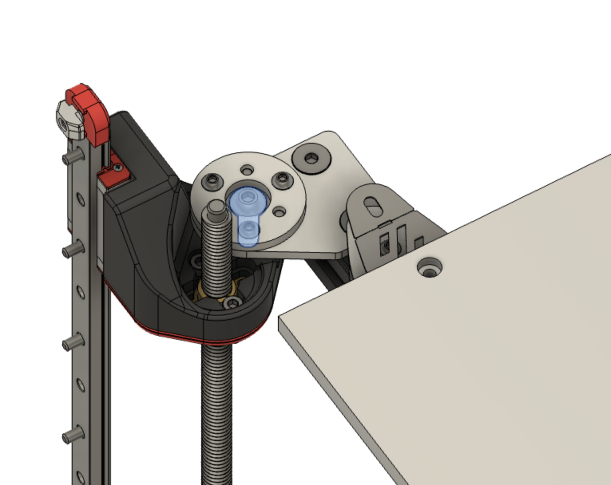

### Step 7: Fix Z endstop

You will also need to lengthen the endstop pin by about 8mm over stock. 
  
  