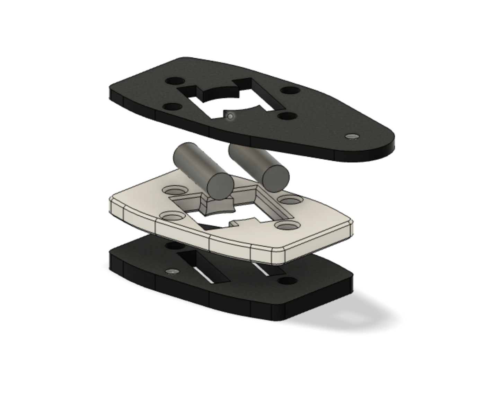
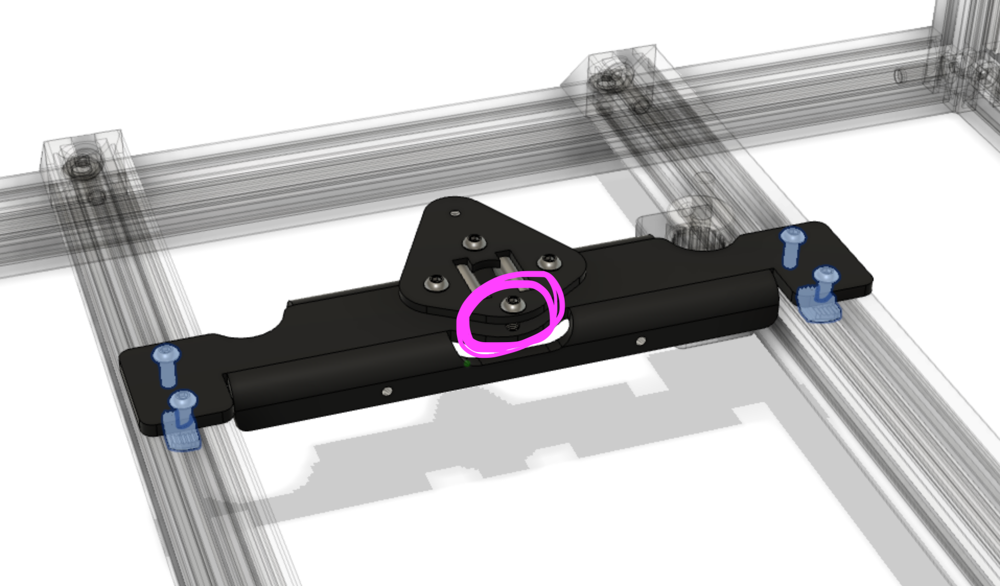

# V2 kinematic mount assembly

You will need to reuse the 4 hammer tnuts from the original bed mount as you need 8 tnuts in total to secure the new kinetic mounts to the frame so make sure you have these to hand during step 2 and 3.

You may want to print the three `sandwich_spacer` STLs to assist in assembling the mounts. These are set to be 0.2mm shorter than the space between the metal plates, and will help avoid overtightening the screws and deforming the mounts, which can affect performance. (Also a nice way to add at a touch of contrasting color!)

### Step 0: Drill center hole in bed

If you are running a stock V2 bed, you may need to add a rear center hole. Fortunately, this is pretty easy to do with a hand drill and some care. You will need:

- Drill or drill press
- 3.4 mm (or 1/8") drill bit for clearance hole
- 6 mm (or 1/4") drill bit for counterbore
- [drill guide STL](./STLs/drill_guide.stl)
- some tape

First, disassemble bed and disconnect all electrical connections. Place the bed upside down on a piece of scrap wood that you don't mind drilling into.

Print off the drill guide, and affix it to the bottom back edge of the bed. Use some M3 screws and hex nuts to clamp it to the standard V2 mounting slots.  Using the 3.4 mm drill bit, drill a hole through the plate at the center hole. Be careful to keep the drill perpendicular to the plate!

Now, flip the plate over to drill the counterbore. Change to the 6mm drill. Measure 4mm up from the corner of the drill bit and wrap the piece of tape around the bit. This will be your stopping depth.

Carefully drill down from the top, using the 3.4 mm hole as a pilot. This should automatically center the larger bit, but take it slow. Stop once the tape hits the top of the plate, and test the depth with an M3 SHCS. 

### Step 1: Assemble spherical bed mounts

Attach the leaf spring to each of the three mount points on the bed (front left and right standard V2 mount points, rear center mount point) using an apporpriate length M3 SHCS for your bed and one of the included thin hex nuts, as shown. There should be 2 to 3 mm of threads protruding from the hex nut. (**Note: the kit ships with M3x8 SHCS, appropriate for the BOM 6-8 mm beds. For thicker beds, you may need to swap out for an M3x10 SHCS.**) The nut should be pretty tight. 

Now, thread the spherical nut on until it bottoms out on the hex nut. This can be just finger tight.

### Step 2: Assemble front mount

First, sandwich two M5x16 dowel pins together and secure with M3x8 BHCS nuts. Tighten maybe 1/2 turn past finger snug. Don't overtighten--you don't want to strip the aluminum threads!

If using the printed spacers, add those to the sandwich as well:

Next, use the M3x14 BHCS to loosely attach a hammer tnut as shown.

Finally, line the bottom front piece square against the front edge of the extrusion. Use the existing channel nut from the stock mounts for the other M3x14 BHCS, then tighten both of them.

Repeat for other side.

### Step 3: Assemble rear mount

The rear mount has some M3 threaded holes on the flanges. If you want, you can use an M3 nuts to attach wago mounts or other things.

Make a sandwich with the M5x16 dowel pins as shown, using 4 M3x8 BHCS. Careful not to overtighten. 

Next, loosely add the remaining two M3 tnuts:

Position the rear mount on the bed support extrusions so that it's approximately in position of the rear of the bed, but do not tighten the screws. Use the two existing channel nuts from your stock mounts for the remaining two screws.

Now, you can place the bed onto the mounts and do precise alignment. Move the rear mount so that it is parallel to the back of the bed, and the ball sits approximately in the center of the hole. Then tighten down the four tnuts.

### Step 4: Align and tighten mounts

This is the most important step to get right: the if the mounts aren't aligned correctly, the sphere nuts will not be able to slide along the dowel pins and your bed has the potential to move!

Make sure the pins are all pointed towards the center, as shown:

Now, use the bed to find the correct location for the rear mount. You want the rear sphere nut to be centered in the cutout, with the mount running parallel to the back edge of the bed and perpendicular to the bed support extrusions.

You may find that printing three of the "install helpers" will help with this. They fit around the sphere nut to help center it in the cutout.

You press the bed down until you're sure the spherical nuts are all indexed against the pins, then tighten the M3x8 BHCS to fix the rear mount. 

If you used the install helper printed part, remove it now.

### Step 4b: Double check clearances

Some users have reported an interference between the wiring bump in their bed heater and the forward-most screw head of the rear mount (circled below).

This primarily seems to be the case for edge-to-edge format heaters.

Check to make sure that your heater isn't contacting the any of the screw heads. If it is, you can use a slightly longer M3 SHCS to attach the ball nut, and add another or a thicker hex nut between the bed and the spring, giving the heater just a little bit more room to clear that screw head.

### Step 5: Preload leaf springs

The bed is now kinematically coupled to the frame. It should feel *very* secure, with no wiggle in lateral motion. However, it is only being held in place by gravity at this point.

To securely attach the bed, but still leave room for expansion, use the M3x6 SHCS to secure the tip of the leaf springs into the threaded hole at the end of each mount. Bend the spring down with your finger, and thread the screw into the hole.

Tighten the preload screw down until you're happy with it. If you pre-bent the spring to 10°, it should be roughly parallel to the mount. This should give somewhere around 3-4 kg of preload per mount:

This should be plenty to keep the bed securely in place, even when flipping the machine over; but not so much that the balls can't move with thermal expansion of the bed. ***Do not tighten the preload screw all the way down!***

### Step 6: lengthen z stop

The kinematic mount raises the bed up by about around 8mm, so you'll want to also extend the Z endstop by about that amount, depending on your setup.

