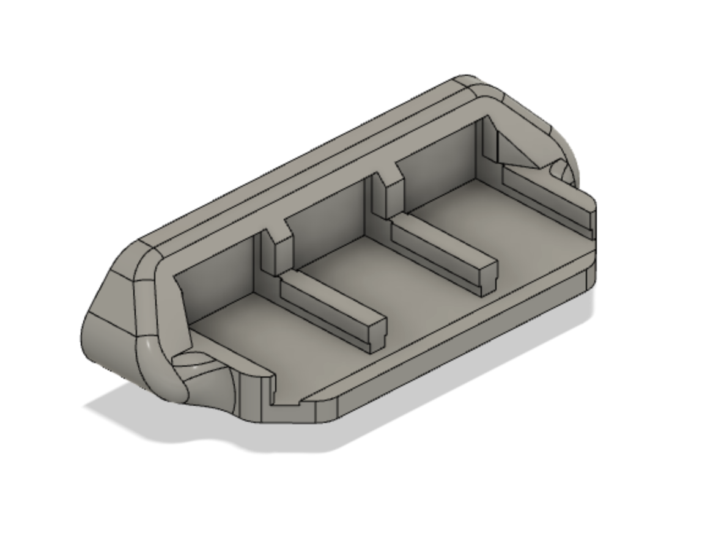
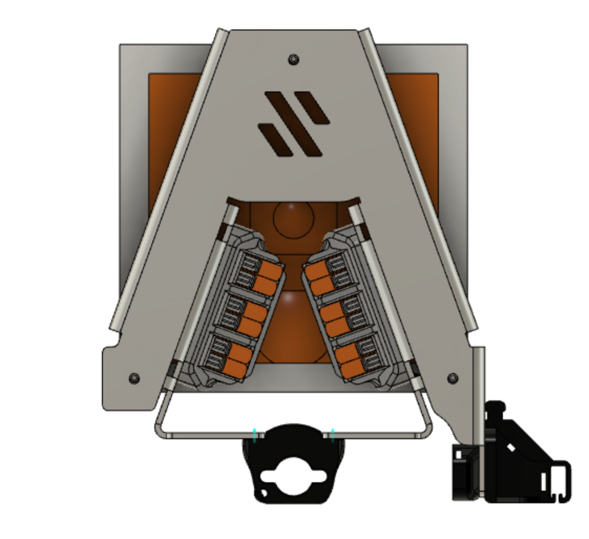
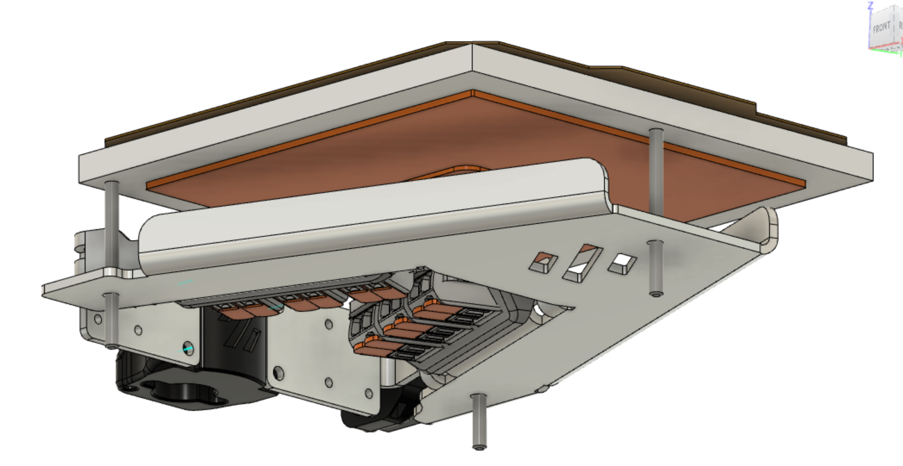

# Wago mount for Kirigami bed

Derived from [BlueBear's](https://github.com/VoronDesign/VoronUsers/tree/master/printer_mods/BlueBear/Wago_221_mount) and [DFH's](https://github.com/VoronDesign/VoronUsers/tree/master/printer_mods/deepfriedheroin/v0_bed_wagos) v0 wago mounts.

I just modified a bit to fit the existing 50mm-spaced holes on the inside lip of the bed.

## Requires:
(per mount)

- 2x heatset inserts
- 2x M3x8 screws
- wagos

