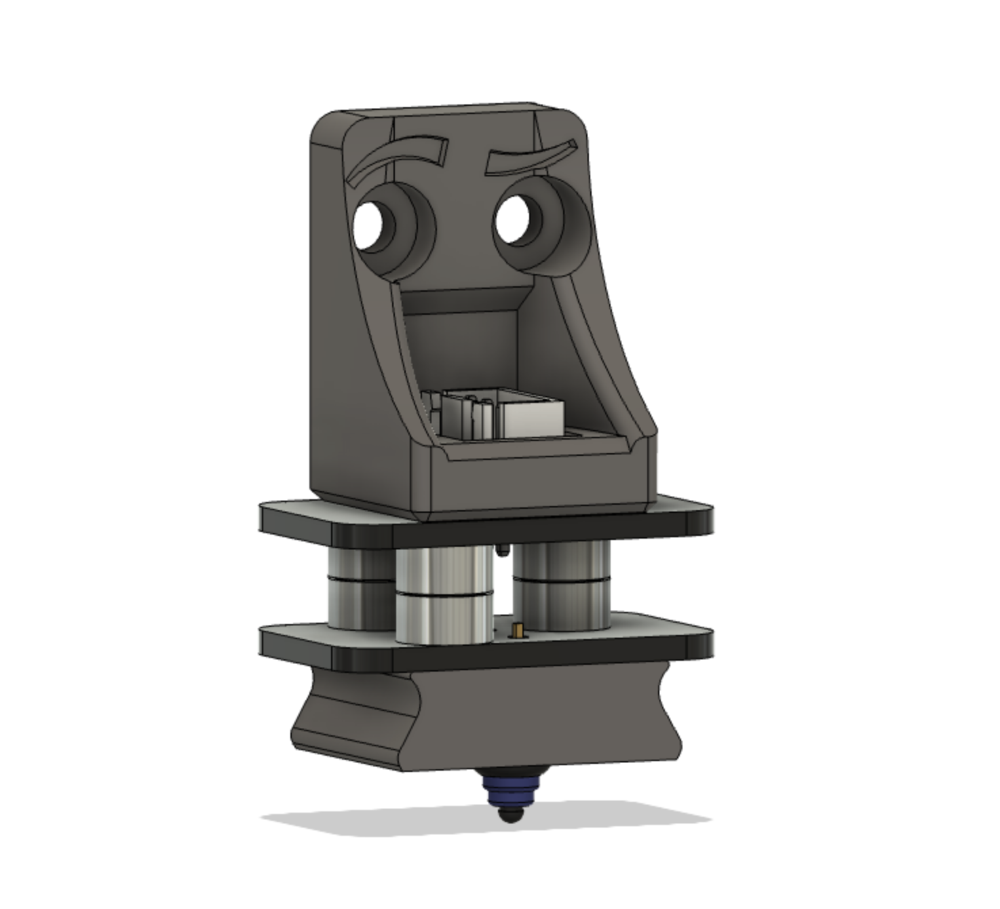
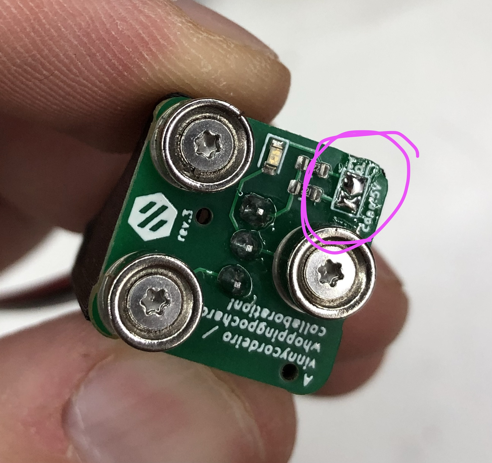
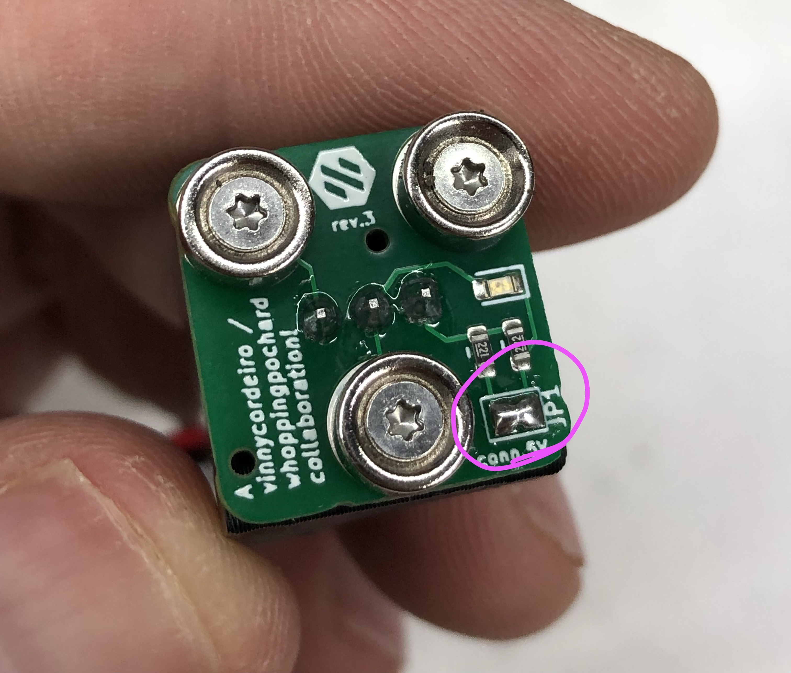
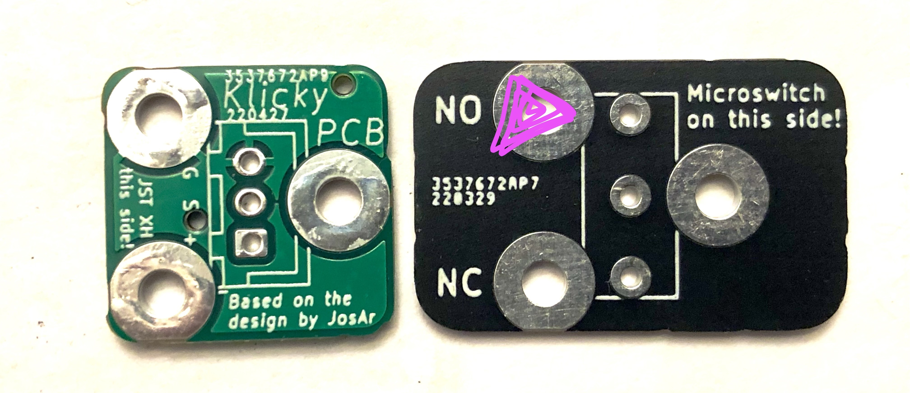
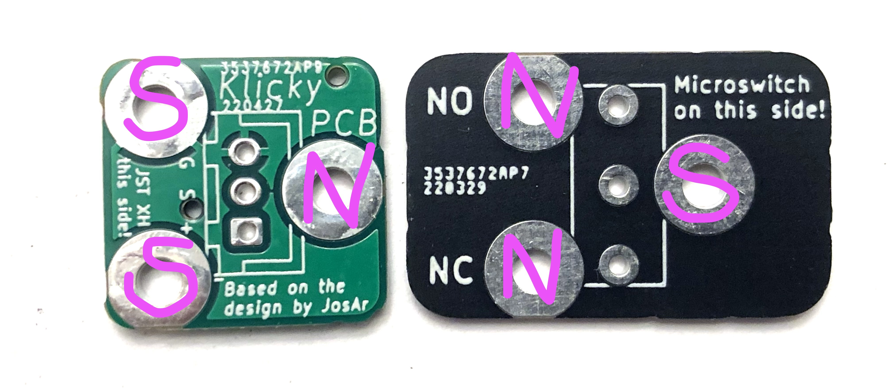
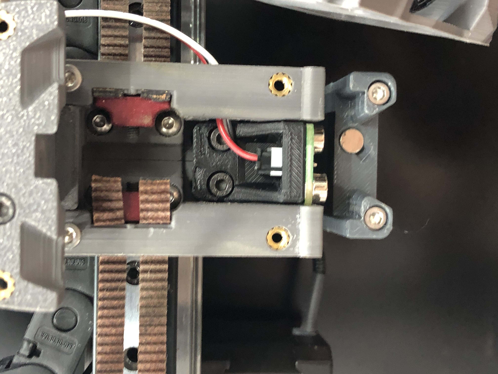
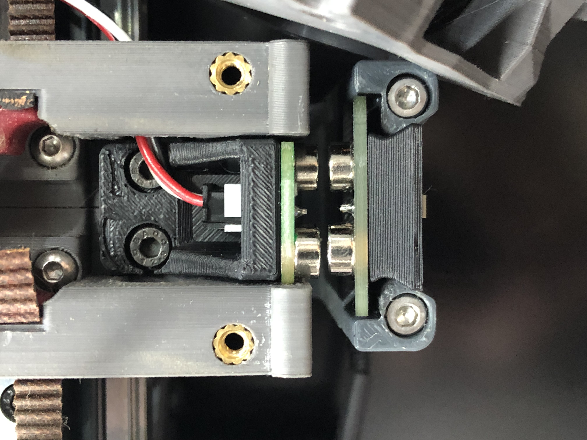
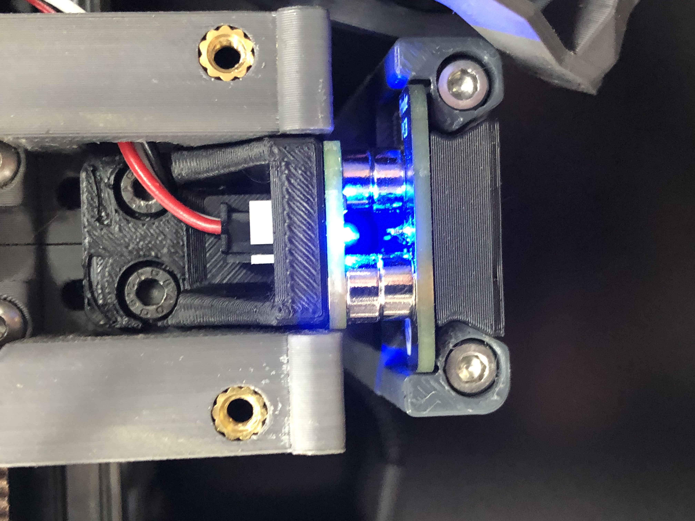
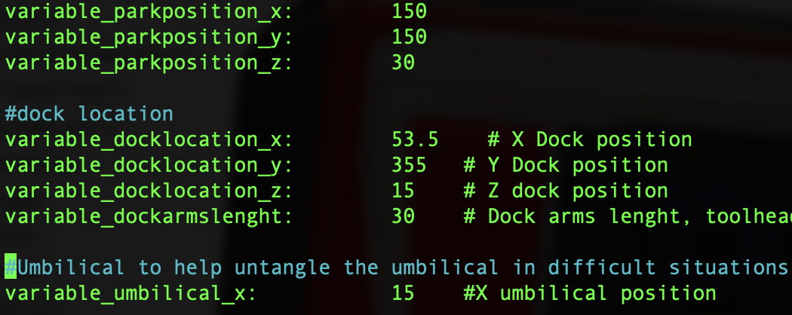
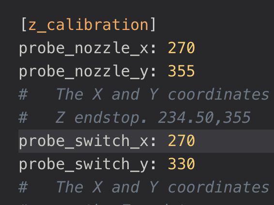

# PCB Klicky

Based on two legends: the [Klicky Probe](https://github.com/jlas1/Klicky-Probe) by JosAr and the [Euclid Probe](https://euclidprobe.github.io)

This design attempts to replicate Klicky as closely as possible using a PCB-based design, to try and achieve the following aims:

1. Reduce the problem of magnets working lose or seating poorly in printed parts
2. Longer switch lifetime by increasing the current being switched --> https://www.youtube.com/watch?v=v5BhECVlKJA&t=4s.
3. Add LEDs to indicate the open/triggered status better

## Bill of materials
- one toolhead PCB (Printed Circuit Board - pre-assembled with SMD components)
- two probe PCBs
- one JST-XH 3 pin header
- one JST-XH 3-wire pigtail connector
- 5 pairs countersunk magnets
- 10 M2x3.2x4mm heatset inserts
- 10 M2x8mm flat head screws
- 2 switches (random dissimilar pair from D2F-01, D2F-01L, D2HW-A201D, and generic D2F clone)
- 3 self-tapping stainless torx drive M2 screws
- 2 carbon steel M3x6mm flat head screws

This material enables you to assemble one complete toolhead mount and two complete probes. 

### CHANGE LOG
- 2022-05-20: updated STLs to better match provided M2 heatset inserts
- 2023-12-05: updated readme file 

## Assembly

### Print parts

The PCB Klicky uses a hybrid printed part / PCB design. The plastic parts serve as the 'nut' into which the screws are fastened, with the PCB sandwiched between the magnets and the printed part and helping to perfectly align the magnets.

You will need one toolhead adapter (`AB_mount`) and two probe adapters (`probe`).
There are STLs included for both M2 heatset and M2 self-tapping screw versions. STLs aren't oriented, please use your best judgement. 

If you have the newer Klicky dock, with the rear-insertion magnet, you may want to print a new front piece with a front-facing magnet position that aligns better with the PCB klicky steel screw head (see `STLs/dock-front_insert.stl`). On my printer, this gives more reliable positioning of the detached probe.

### Modify toolhead PCB to fit your probe voltage

PCB Klicky includes an indicator LED and current-limiting / pull-up resistor to ensure the rated current is passed over the microswitch. If having an exposed voltage rail on the bottom of your toolhead gives you the heebie-jeebies, you can just not connect the +V pin and it will function identically to a normal klicky probe.

If you do choose to enable the indicator LED, you'll want to make sure you have selected the appropriate resistance. 
The board has a solder jumper (J1) in an *open* state, forcing the current to flow through the 2.2 kΩ resistor. Leave this pad as-is if you are operating the probe at 24V (for example, when replacing an Omron 24V inductive probe) and sending the signal back through a BAT85 diode or similar connection.
For 3.3/5V probes, you may choose to bridge this jumper to allow a lower-resistance path to ground, ensuring ~10 mA passes over the switch contact:

#### 24V: Open Solder Jumper

#### 3,3/5V: Bridged Solder Jumper

### Solder switches and connectors

Solder the JST header on the upper side of the toolhead PCB. Follow the silkscreen instructions for the JST header.
And the microswitches on the appropriate sides of the probe PCB´s. Line the 'plunger' side of the microswitch up with the text "microswitch on this side!". See arrow in the picture below:

### Install heatsets

Install heatsets in the printed part, taking care to ensure that they're flush with the surface of the part.

### Attach magnets

Make sure to keep your polarities in order! I used the dissimilar orientation on the odd-side of the boards, as in the following diagram:

***TIP!!*** You can use an app on your phone to determine magnet polarity! This is useful in case you make up more probes later and want to make sure they match. [iOS link](https://apps.apple.com/us/app/kj-pole-id/id1323248335) / [Android link](https://play.google.com/store/apps/details?id=air.de.supermagnete.magnetapp&hl=en_US&gl=US&pli=1) (Thanks so much PF!!)

***NOTE:*** Make sure that the rear of the toolhead board doesn't extend past the back of the adapter part when attaching the magnets! This will prevent the adapter from sitting flush in the toolhead. You can place the assembled adapter back-down on a flat surface and loosen all three magnet screws to make sure.

### Insert ferrous flat-head screw into probe

There is a spot to screw an M3 flat-head cap screw into the back of the probe; this is attracted by the magnet in the Klicky dock, helping to retain the probe when docking. 

### Install in toolhead

When replacing an original Klicky probe, start with the toolhead adapter pushed up higher into the carriage:

Then move the toolhead over the normal klicky dock location (you may need to jog 2mm to the right from your normal dock X location, see below). Place the probe into the dock, and slowly lower the toolhead adapter until it contacts the probe, and is not pulling up or pushing down on the dock. In my printer, that left the toolhead PCB just about flush with the bottom of the carriage.

## Klipper configuration

You will only need to tweak a couple values from a [standard Klicky config] (https://github.com/jlas1/Klicky-Probe/tree/main/Klipper_macros) install to make PCB klicky work.

### Adjust dock location

To make sure the switch plunger is in-line with the nozzle, the original Klicky body is slightly off-center. Because PCB Klicky changes the switch orientation, to be in-line with the nozzle, the body is now centered. This means you will want to increase the X position of your dock by about 2 mm in the klicky macros.cfg file. 

In my printer, that means I changed `variable_docklocation_x` from 51.5 to 53.5:

### Adjust auto-Z trigger location

If you're using auto-Z calibration, the printer needs to probe the switch body with the Z endstop. Because that's in a new place, you'll need to update the corresponding variable in your config file. 

Your new `probe_switch_[x/y]` position should be in-line with the nozzle in X, and around 25 mm forward in Y:

## Test Probe

### Double check wiring

Make sure you've connected your wires correctly to the probe. With the probe installed in the toolhead, they should be Ground / Signal / +V going from back to front.

### Check probe logic when detached

With the probe board disconnected, the probe should read as triggered. Double check this by sending a `QUERY_PROBE` command. 

### Check probe logic when attached

If you've connected the +V wire to the PCB, you should see the LED turn on when you attach the probe. 
When sending a `QUERY_PROBE` command, it should return `probe: open`. 
When you close the switch, the LED should turn off, and `QUERY_PROBE` should again return `probe: TRIGGERED`.

### Check probe docking sequence

With the probe in the dock, verify that it attaches and detaches successfully. Then, check that it can do QGL and auto-Z, if enabled.

### Tweak auto-Z offsets
 
You will probably need to adjust your auto-Z offsets, if you have it set up. 0

## Feedback

If you read that far, you are maybe interessed in making PCB_klicky even better and i would be very grateful if you could fill out a feedback survey so I can improve the kit in the future!
