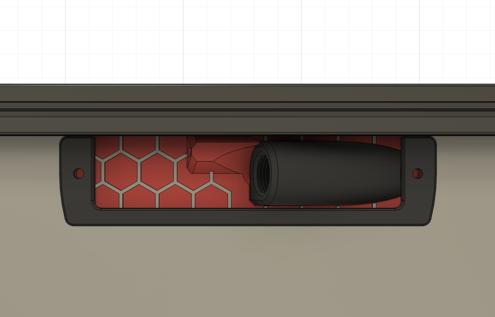
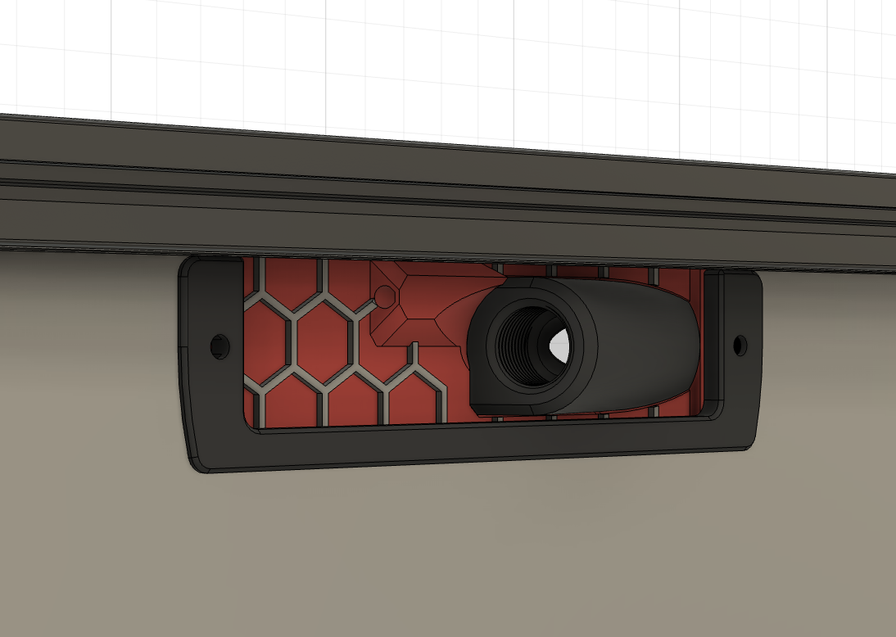
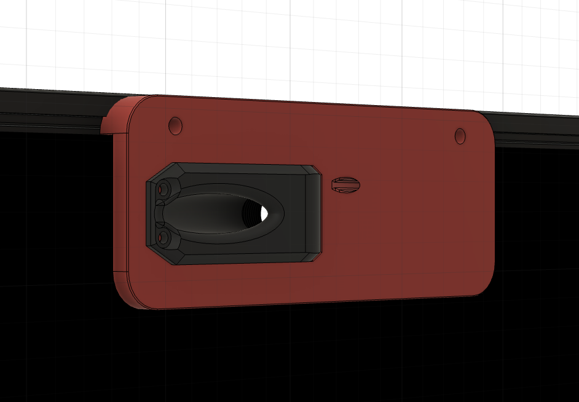
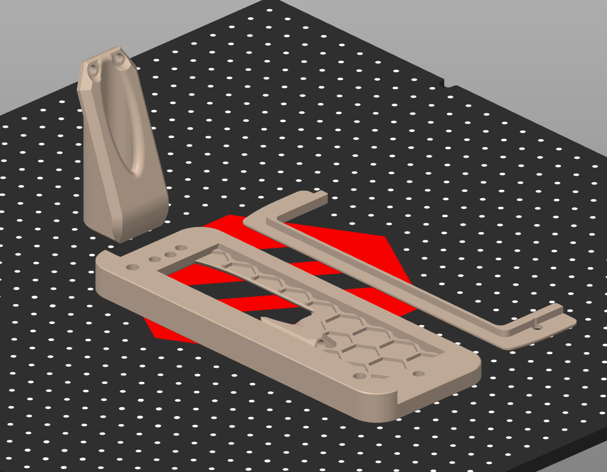
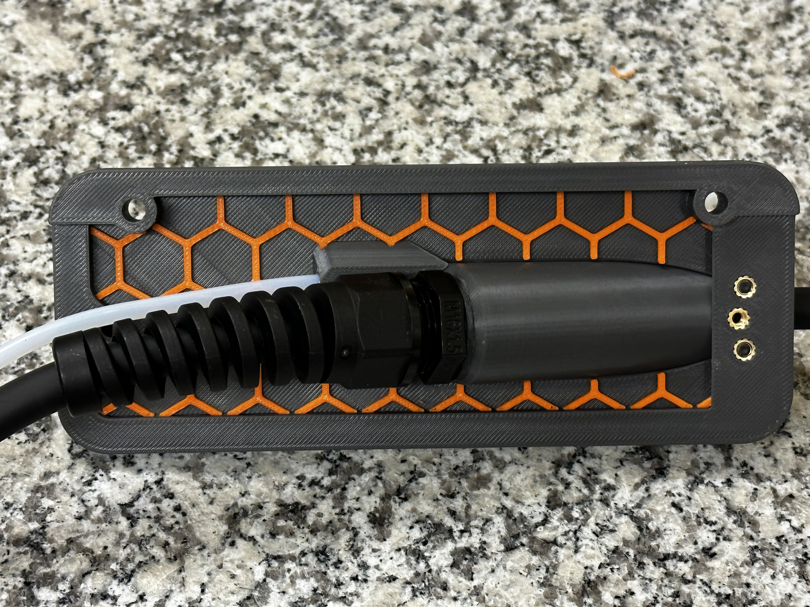
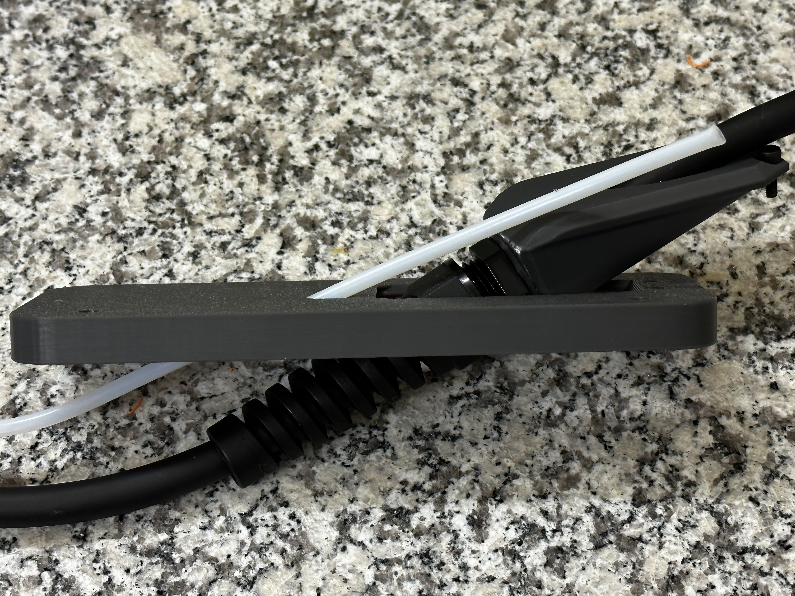

# Umbilical Rear Passthrough

## Motivation

I wanted my umbilical to come in through the exhaust cutout rather up from the A drive. Additionally, I wanted it to come in at an angle, rather than straight through, as I think it's going to give me a better overall cable fit in the chamber. We'll see! Some day I may even install this.

Based on the [Back plate blanking plate](https://github.com/VoronDesign/VoronUsers/tree/master/printer_mods/richardjm/back-plate) by the legendary Richardjm, which I've been using forever. 

## Printing

I generally can't be bothered to orient STLs, sorry!

The cable gland adapters may need a brim depending on your build plate stickiness.

There are versions of the backing plate for 3mm, 4mm, and 6mm total panel thickness stackups.

To include the hex accent, drag it in to PrusaSlicer or whatever at the same time as the UmbilicalBlankingBackPlate, and choose to import as single body with two parts. (In PS you'll need to have multiple extruders [turned on in your printer settings](https://help.prusa3d.com/article/importing-multi-material-model_121191) for this to work.) Then you can use a layer change color swap or MMU unit to get it as an accent color. 

## Assembly

There are a few heatsets that need to be installed, and then stuff sorta screws together. 

The umbilical passthrough is designed to allow you to assemble it off-printer, including the gland, adapter, and toolhead connector or PCB, and then stick it all together through the back plate. A couple short M3 screws will lock it in place. 

