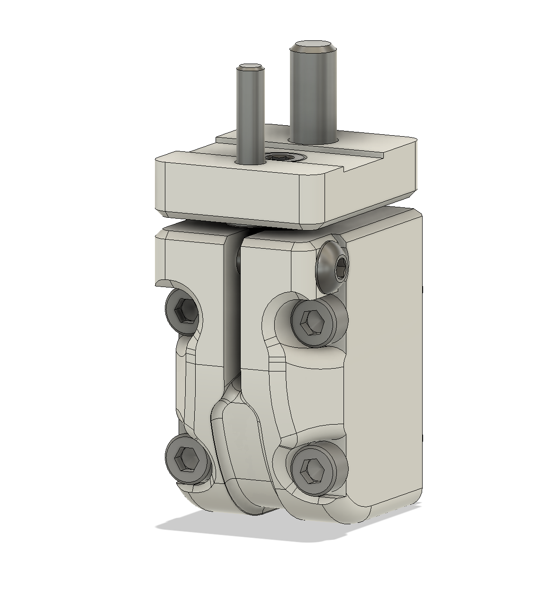
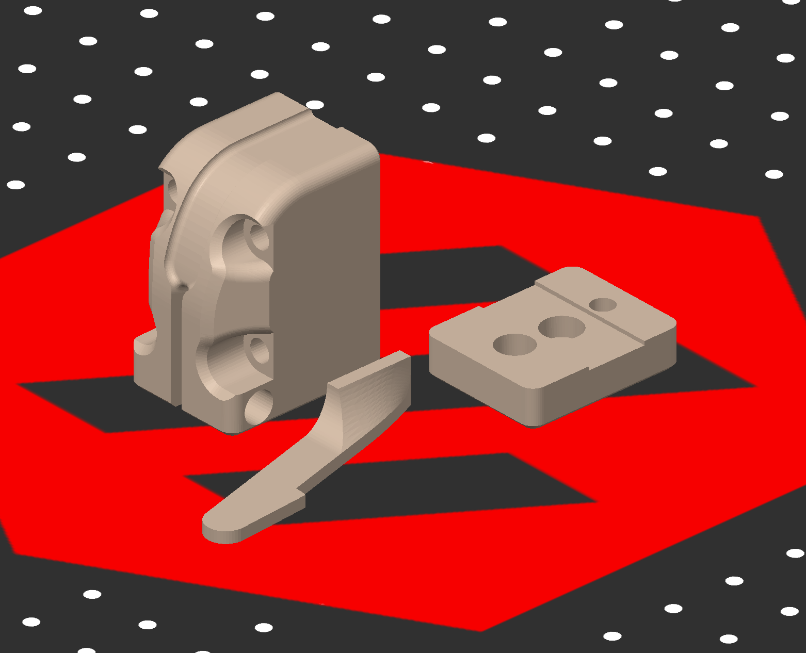
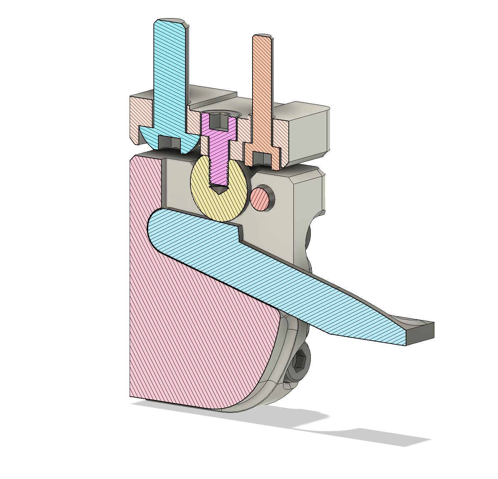

# NOTE: Beta release. These might not work! Currently untested!

# Rock'em Sock'em V2 Z Joints

These Z joints originated from my desire to have a joint that 1) allowed for more rigid constraint of the gantry in the XY plane, but 2) still allowed for some rotational movement in the joints, while 3) reducing the distance in Z from carriage to gantry, and 4) allowing disassembly of joint independent from belt clamping. 

## BOM

| Qty | Item                     | Link |
|-----|--------------------------|------|
| 4   | 9mm M3-tapped sphere nut | [AliExpress](https://s.click.aliexpress.com/e/_Dk9ktxZ)|
| 4   | M3x6mm SHCS              |                                           |
| 4   | M3x14mm SHCS             |                                           |
| 4   | M3x4x5mm Heatset Insert  |                                           |
| 4   | M3x18mm BHCS             |                                           |
| 4   | M5x14mm BHCS             |                                           |

## Printing

The parts are designed to be printed as shown. Standard Voron parts profile should work fine (4 perims / 40% infill). 

You'll need to print two of the mirrored and two of the non-mirrored lower parts.

You only need one lever.

## Assembly

There's an order of operations here. 

### Assemble top piece

First, put the M3x14 SHCS and M5x14 BHCS screws through the hole in the belt clamp. They'll be retained in their counterbores by the sphere nut, so they won't fall out on you when installing upside down. Noice.

Next, use the M3x6 SHCS to attach the sphere nut. You may want to use some threadlock on this screw, but if you have liquid threadlock instead of the stick version, be careful not to get any on the plastic!

### Assemble bottom piece

Install the heatset insert in the lower piece, then loosely thread in the M3x18 BHCS for clamping. Don't tighten this until you connect the joints!

### Install belt clamps on gantry

You can now replace the old belt clamps with the new ball joint clamps.

### Install lower piece on Z carriages

Reuse the M3x20 SHCS from the original mounts to mount the lower pieces. Make sure to have the heatsets facing outwards (towards the panel) so that you can tighten the joint after installation. 

If you use a hall effect endstop in the rear right joint, use an alloy steel (not stainless) M3x20 SHCS in the upper right hole in that joint. Then stick a 6x3mm neodymium magnet to the screwhead. It's in the correct spot to trigger the endstop now! Woo!

### Connect joint

Now just press the ball into the socket. It will take some pressure. Try QGL without the clamp engaged at all. Once it's good, tighten down the M3x18 BHCS to secure the ball joint to whateever level of tension you feel is appropriate.

## Disassembly

To remove the ball from the socket, loosen the M3x18 BHCS, insert the printed lever through the slot to the back of the joint.

Then press upwards on the lever to pop the ball out of the socket. Pop!

https://github.com/tanaes/whopping_Voron_mods/assets/8292608/5f2148d0-707d-45ca-baed-95844d62153f

